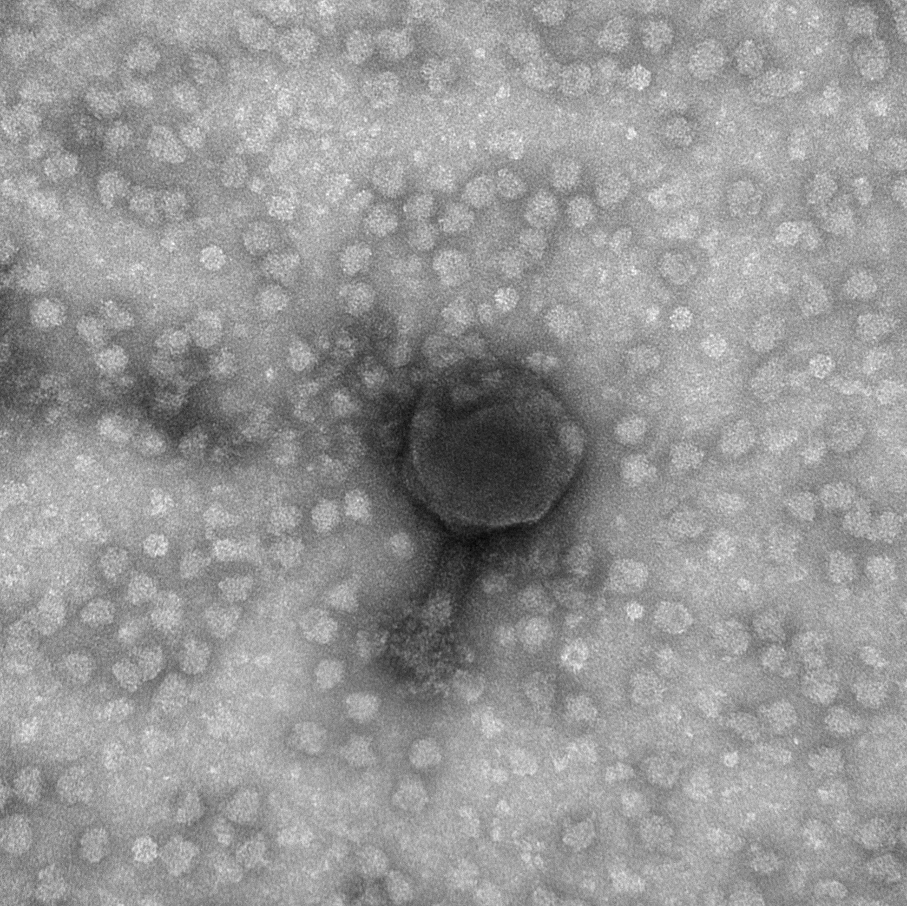
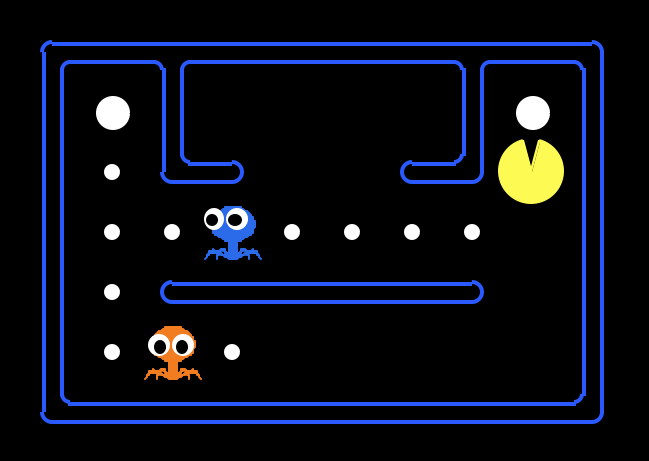

# Acknowledgements {-}

```{r, results="asis", echo=FALSE, out.width="90%"}

```

At some point during our many meetings, my advisor Martin looked at me and said, "well, I suppose it takes a village." This statement sums up my graduate experience very concisely, and I'll now proceed to ramble on about the village that was kind enough to support me throughout graduate school.

First, as already mentioned, my advisor, Martin Polz, has been incredibly patient with me, allowing me the freedom to learn anything I felt an impulse to learn. And while at first he very rarely discouraged going down new paths, he became quick to warn me against rabbit holes when he realized my inability to avoid them. His occasionally uncanny insights often lead me to wonder whether he's been hiding the answers all along.

My co-advisor Libusha Kelly is always willing to provide feedback on everything I write, however hopeless or trivial the draft may be. She has been kind enought to make trips from New York in order to attend my committee meetings in person. And I very much appreciate her thoughtfulness in asking just the right questions whenever I lack the capacity for words. 

The Computational Sciences Graduate Fellowship through the Department of Energy supported me financially during four years of my PhD, and provided me with funding for workstations, conferences, and professional development. I am incredibly grateful for their support. Their "requirements," which I like to think of as perks held me to the promises I made to them and to myself upon first starting graduate school.

I have been incredibly lucky to have benefitted from starting my PhD following the heroic efforts of Kathryn Kauffman in carefully assembling and archiving the Nahant Collection. Working with this dataset and the organisms themselves has been very fun an challenging, and an amazing avenue for me to synthesize and process what I'd studied in books and classes. I'm grateful to Fatima Hussain for having taught me to grow phage, Joseph Elshirbini for having introduced me to the joys and headaches of javascript, Javier Dubert for showing me how to transform *Vibrio*, Dave VanInsberghe for rescuing me from my NCBI submission woes, Annie Yu for being a partner in crime during all the late night experiments, Fabiola Miranda for allowing me to use her reagents whenever I'm unprepared myself, and Bruno Janeiro, Clovis Borges, Hannah Gavin, Manoshi Datta, Nate Cermak, Phil Arevalo, Alison Takemura, Diana Chien, Christopher Corzett, plus anyone who I've failed to mention for all the serious scientific discussions as well as the occasional banter.

My committee, who, having students of their own to advise, has been gracious in donating many hours of their time toward ensuring my scientific and mental sanity. After seeing that I had an interest in tRNA, and knowing of my utter incapacity for working with RNA at the bench, David Bartel introduced me to a post-doctoral fellow in his lab, Wenwen Fang. I am very grateful toward Wenwen, without whom the entirety of Chapter 2 would not have been possible. Despite having witnessed my denseness as a student in his class Jeff Gore agreed to serve on my committee and has provided me with incredible scientific, career, and life advice. I learned through working with Philippe Rigollet that, even if I'm entirely intimidated, it's much better to ask questions in person when I don't understand than to spend many emails trying to type math into paragraphs while trying to implement the algorithm we'd discussed - which he was patient enough to bear with me through.

As teaching truly is the best way to learn, I'm very appreciative of Aviv Regev and Piyush Gupta's willingness to allow my co-TA Jonathan Teo and I to experiment with new homework problems and different ways of teaching recitation. I learned so much from Caroline Uhler and Stefanie Jegelka, as well as from my co-TAs Jennifer Tang, Abigail Katkoff, and Tahin Syed. I'm also very thankful for all of the students who I've served as a TA to for their patience and support in humoring my antics and for allowing me to learn with them.

I must also thank the patience and ingenuity of anyone who's ever taught me. While I won't rattle off all of my teachers since preschool, I am certaintly grateful to every one of my teachers since preschool.

```{r, results="asis", echo=FALSE, out.width="70%"}

```

As for all of the social support I've been blessed with, I will mention the groups but refrain from listing individual names due to a preference for privacy. I hope it is nevertheless clear how much I appreciate everyone, and I hope this does not offend anyone that I do not list by name.

The Parsons Laboratory has been a great place for learning about environmental sciences, as well as for making what I feel will be life-long friends. I can't imagine going through graduate school without this wonderful community.

The Computational and Systems Biology graduate students is such a fun group of fascinated and fascinating individuals. Together, we studied, joked about hypothetical science, and wandered the alleys of Kennebunkport. 

Through the Computational Sciences Graduate Fellowship, I've met so many people from all over the US in various disciplines, all excited about computing. I feel very lucky to have been able to share science and shenigans with them every year.

For all of the roommates that I've lived with, thank you for tolerating me. My first year roommate fed me and dragged me home when I was still acclimating to graduate school and barely able to function. During my second and third years, I felt that I'd truly found a home in 22 Mag, and this is entirely due to the warmth and generosity of my roommates. I am amazed that we'd turned our pantry into a lab. And as for 77, where I landed after signing a roommate agreement littered with hidden white text, I still suspect that everyone is in on the long con. Beyond all the craziness of shoving trees out the window and throwing pumpkins off the roof, you're my people and I care about you.

I must also mention all my Bears who've supported me beyond college and has made an effort to keep in touch through assembling the most socially-conscious and depressing book club fathomable; a fantasy football league, where the only currency exchanged is embarassment; and superbowl squares, when regardless of where everyone is living, we all get on messenger to exchange gifs.

After quizzing one of his students, Tukey purportedly thought for a while and said "Well, what I think you need is folk dancing." I would like to thank everyone above for folk dancing with me. Without all of you, I would not feel human.

And finally, I would like to thank my parents, Aiping Dai and Dan Yang, for providing me with endless advice, asked and unasked for. I am grateful for all of their unconditional love and support, and for having placed me in an environment where I never needed to worry about basic needs or survival instincts, and so, had the freedom to develop a love for learning.


