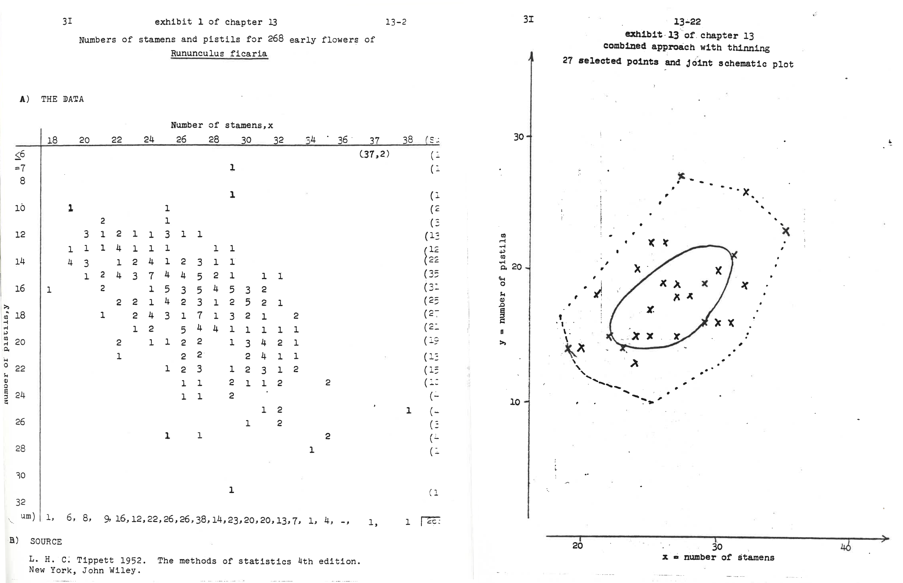

---
output:
  pdf_document: default
  html_document: default
---
# Introduction {#introduction}

There are approximately 10 million viral particles per milliliter of sea water [@Bergh1989]. At such numbers, these tiny 30-100 $nm$ particles can have an enormous impact on the ecosystem. To illustrate with a particularly stunning example, *Emiliana huxleyi* (a marine algae) can bloom to 1-100 thousand cells per mL over an area of 250,000 $km^2$ (in the upper 200 $m$ of the ocean) [@nasa]. After only a week, these blooms collapse, releasing calcite into the seabed and cloud-forming dimethyl sulfide into the atmosphere. This population collapse is largely attributed to predation by coccolithoviruses [@Wilson2002;@Schroeder2003].

The most common viruses are bacteriophage. These viruses' hosts (bacteria) are also abundant, at around 1 million cells per milliliter of sea water. This means "rare" events can happen frequently. For example, in order for a successful lytic infection to occur, a phage must encounter a bacterial host whose cell surface proteins it can bind to, protect itself from the host restriction modification systems, and replicate within its hosts cellular environment. All these road blocks make successful lytic infections rare [@Hyman2010]; however there are approximately 36 million $km^3$ of water in the top 100m of the sea. Therefore, rare events for a single cell do not equate to rare events for the whole population [@Fuhrman1999]. In fact, it has been estimated that new viruses are produced at rates of 1 million to 10 million particles per milliliter per hour [@Wilhelm2002]. From this, assuming an average burst size of 50 viruses per lytic event, the number of infections initiated by phage per second somewhere in the ocean can be very roughly approximated to be on the order of Avagadro's number [@Hendrix2003]. \newline

```{r coccolithophores, results="asis", echo=FALSE, fig.cap='\\label{fig:coccolithophores}Emiliania huxleyi population collapse within a week of the bloom (bloom depicted here, image from NASA Earth Observatory) is largely attributed to predation by coccolithoviruses.', out.width="50%"}
include_graphics("figuresintro/coccolithophores.png")
```

Lytic infections select for resistant hosts, forcing the population to diversify, and resistant hosts select for compatible phage variants. This rapid, recursive evolutionary arms race occuring at such a large scale leads to highly diverse phage. The recent explosion in bacteriophage genomes has revealed that phage genomes are highly mosaic in structure [@Hendrix1999], suggesting frequent recombination; and contain hoards of uncharacterized proteins. On average, approximately 70% of open reading frames in a phage are unannotated hypothetical proteins [@Gonzalez2015]. While perplexing, this vast unknown may hold exciting prospects for future research.

## Background on phage research, focusing on one-step growth

Bacteriophage were discovered in 1915 by Frederick Twort then independently again in 1917 by Felix d'Herelle. These "anti-microbes" were first studied for their potential to treat bacterial infections, but this interest declined in the 1930s due to the success of antibiotics. However, bacteriophage research quickly became foundational to molecular genetics [@Griffiths2000;@Salmond2015], as their small genomes, rapid growth rate, and low-maintenance nature make them particularly convenient for experimentation. In fact, many of the insights into the nature of DNA came out of "the phage group," an informal network of researchers centered around Max Delbrück, who, starting in 1945, taught an annual phage course in Cold Spring Harbor [@Maloy]. For example, in 1943, Salvador Luria and Max Delbrück showed using T1, the (lack of) Poisson distribution, and jackpotting that mutations occur spontaneously and can be selected for, as opposed to being induced by a selection event [@Luria1943]. In 1952, using the T2 phage and a Waring blender, Alfred Hershey and Martha Chase showed that it is DNA, and not protein, that encoded the genetic material [@HERSHEY1952]. In 1957, Seymour Benzer showed using T4's rII gene that recombination occurs on the nucleotide level [@Benzer;@Benzera]. In 1961, Crick, et al. showed, using Benzer's T4 rII system and various combinations of double and triple frameshift mutations, that the genetic code consists of triplet bases [@CRICK1961]. We will next outline in greater detail a particular study, the Ellis and Delbrück one-step growth experiment. As one of the earliest "phage group" studies, it laid out the experimental framework for others to come. Much of this framework is still widely used today; and in fact, for the purposes of this thesis, the following background may help clarify the methodological details presented in Chapter 2.

The Ellis-Delbrück study marks the introduction of Max Delbrück to bacteriophage research [@Summers]. In the mid-1930s, Emory Ellis was an analytical chemist at Cal Tech working in cancer research. He had been drawn to cancers induced by viruses, such as the Rous sarcoma virus and the Shope rabbit papilloma virus; however, as so little was known about viruses at the time, he decided that a fundamental understanding of their biology was necessary in order to proceed. So he chose to start with bacterial viruses (as opposed to mammalian viruses or plant viruses) for the practical considerations of time, space, and cost. At the time, however, the most commonly accepted view, championed by Jules Bordet and John Northrop, was that the bacterial lysis witnessed by d'Herelle had been incorrectly interpretted as an infection by an exogenous body, when it was actually an endogenously catalyzed lytic event. Ellis's goal was therefore to replicate d'Herelle's studies by first isolating a virus for *E. coli* from sewage (as he had a culture of *E. coli* gifted to him by a colleague), then reproducing the stepwise pattern of phage growth.

Max Delbrück, on the other hand, had studied theoretical physics. And influenced by Niels Bohr, he ventured into biophysics, where he became interested in characterizing the nature of the gene. Eventually, Delbrück arrived at Caltech to work on Drosophila genetics, but quickly became frustrated. Instead, he developed an interest in viruses and bacteriophage, thinking that "the growth of phage was essentially the same process as the growth of viruses and the reproduction of the gene." So he sought out Ellis, and the two began to collaborate. The above biographical details of Ellis and Delbrück's work together is summarized from William Summers' *How Bacteriophage Came to Be Used by the Phage Group* [@Summers].

```{r onestepgrowth, results="asis", echo=FALSE, fig.cap='\\label{fig:onestepgrowth}By synchronizing infection assaying phage concentration at short, approximately 10 minute, time intervals, Ellis was able to see that phage growth appears to occur in bursts. The y-axis shows P/P0 in log-scale. P0 is the initial concentration of plaque forming units, and P is the concentration at a particular time. This image is from their original paper, \\textcopyright 1939, by The Rockefeller Institute for Medical Research, adapted under \\href{http://creativecommons.org/licenses/by-nc-sa/4.0/}{CC BY-NC-SA 4.0}', out.width="70%"}

```

The Ellis-Delbrück paper [@Ellis1939] combines the work that Ellis had been doing on phage growth curves with Delbrück's characterization of the statistical nature of infections, which has, over time, evolved into the statistics of what is now known as the multiplicity of infection (MOI, or, the ratio of phage particles to bacterial cells).

The setup of Ellis's one-step growth experiment was simple. Essentially, the idea was to synchronize at least the first round of infection in the following way:

1. Mix bacteria and viruses at a high concentration (on the order of $10^9$ bacteria and viruses per mL), allow 5 minutes for the viruses to adsorb onto their hosts.

2. Dilute this mixture thoroughly using growth media (at a 1:12,500 ratio) so that additional adsorption is unlikely to occur.

3. At approximately 5 minute intervals, plate samples of equal volume of this dilution on a background of concentrated bacteria in order to count how many viral particles had formed.

From this type of growth curve, it is possible to deduce the latent period, or the amount of time a phage spends replicating within a cell before the progeny lyse the cell; as well as the burst size, or the number of phage progeny that are produced from each infection.

Delbrück's statistical characterization of phage infections was equally intuitive. When there is a uniform probability for an event to occur in time or space, the number of events that occur in a given interval of time or section of space follows a Poisson distribution. A few concrete examples of events that can be modelled using a Poisson distribution include the number of yeast cells in each batch of Guinness beer (courtesy W.S. Gosset, or "Student," of the Student's T-test) [@Boland1984], the number of phone calls arriving at a call center within a minute (A. K. Erlang), or the number bombs that fall in regions of London during World War II (R. D. Clarke) [@Clarke1946]. Analogous to these examples is the number of bacteriophage present in a given volume of liquid. In particular, the probability of seeing $k$ phage in a milliliter is
$$P( X = k ) = \frac{ \lambda^k e^{-\lambda} }{ k! }$$
where $\lambda$, the rate parameter, is the average number of phage present in each milliliter.

```{r poisson, results="asis", echo=FALSE, fig.cap='\\label{fig:poisson}On the left is a picture of a phage plaque assay on a petri dish. The light hazy layer in the picture is a "lawn" of bacteria, and the spots scattered on top are "clearings" or "plaques." These plaques each can roughly be thought of as having grown out of one infection. The plaque count should then be proportional to the concentration of phage used for the plaque assay. On the right, a poisson distribution describes counts of an event in fixed intervals when there is a uniform probability for occurrence over the entire space. Phage dispersal on a plate is roughly uniform, and so plaque counts on equal areas should follow a Poisson distribution. The image analysis above was done with freshman miniUROPs Madelyn Focaracci and Jessica Wang. A timelapse plate read is also available online: \\href{https://youtu.be/93p5phFAuo0}{https://youtu.be/93p5phFAuo0}.', out.width="100%"}

```

One way to infer this parameter is to simply take the average - after making multiple plates of one milliliter aliquots of the same sample, count the number of plaques (or infection clearnings) on each plate, and divide this by the number of plates. This is, in fact the maximum likelihood estimate, $\hat{\lambda}_{MLE} = \frac{1}{n} \sum_{i=1}^{N} k_i$.

Delbrück suggested another way to infer this parameter - according to the Poisson distribution, the fraction of plates without plaques is expected to be 
$$P( X = 0 ) = \frac{ \lambda^0 e^{-\lambda} }{ 0! } = e^{-\lambda}$$
The rate parameter can then also be estimated as $\hat{\lambda}_0 = -log(\frac{N_0}{N})$, where $N_0$ is the number of plates without any plaques.

Ellis and Delbrück observed, however, that there was consistently a discrepancy between the two estimates. The second was almost three times higher than the first (in their paper, $\hat{\lambda}_{MLE} = 0.22$, while $\hat{\lambda}_0 = 0.56$). This lead them to conclude that there may not always be a direct correspondence between phage particles and plaques[^1]. The comparison of these two estimates was termed the "efficiency of plating."

[^1]: Because the title of this thesis includes the word "statistical," there is some pressure to be statistically precise. So to be fair, the second estimate, $\hat{\lambda}_0 = -log(\frac{N_0}{N})$ is a biased estimate of $\lambda$. $N_0 \sim Binomial(p_0, N)$, where $p_0 = e^{-\lambda}$. Using a Taylor expansion around $p_0 N$, we see that $E(log N_0) = log(p_0 N) - \frac{1-p_0}{2p_0 N} + O(1/N^2)$. Therefore, $E(\hat{\lambda}_0) = \lambda +\frac{1-p_0}{2p_0 N}+O(1/N^2)$. This calculation can be verified by plugging in values of $N$ and $\lambda$ and either running simulations or taking the sums. Given Ellis and Delbrück's experimental setup, this bias is small. Forty plates were tested, and if we assume the true rate parameter was 0.22, the first order bias term is 0.003, which doesn't come close to the discrepancy observed. Their conclusions are, therefore, still well-founded.

The efficiency of plating is not a very commonly reported statistic today, perhaps because the biological meaning of this statistic is somewhat opaque. However, the application of the Poisson distribution toward approximating phage infections has been adapted slightly and is now still commonly used to design experiments. To elaborate, if we assume that all plaque-forming phage are able to find a host, then the bacterial cells themselves are now analogous to the milliliter aliquots from the description above. The number of phage infecting each bacteria follows a Poisson distribution, with the rate parameter being the multiplicity of infection (MOI), or the ratio of phage particles to bacterial cells. The proportion of uninfected bacterial cells (infected by 0 phage) can be expected to be $P(Y = 0) = e^{-\lambda_{MOI}}$, the proportion of bacterial cells infected by just 1 phage can be expected to be $P(Y = 1) = \lambda_{MOI} e^{-\lambda_{MOI}}$, and the proportion of multiple infections, or bacterial cells infected by more than one phage, can be expected to be $P(Y > 1) = 1-(1+\lambda_{MOI})e^{-\lambda_{MOI}}$. For phage-host pairs where infection by more than one phage results in a different infection phenotype than infection by just one phage, it may be of interest to the experimenter to pick a low MOI, tuning $P(Y > 1)$ in order to control the number of multiple infections. For experiments where the goal is to observe a signal during infection, for example, RNA sequencing looking for changes in host gene expression during infection (as is the case in Chapter 2 of this thesis), it may be of interest to the experimenter to pick a high MOI, tuning $P(Y=0)$ in order to reduce the background signal from uninfected cells.

Returning to the Ellis-Delbrück paper, the authors go on to describe many additional carefully executed experiments, which will not be further described here. However, to summarize a few highlights, they were able to conclude that plaque counts correlate incredibly well with phage concentration, and so each plaque likely grew from one instance of infection; during the growth experiment, phage concentration increases in a stepwise manner, indicating that phage are produced in bursts; and phage growth depends on bacterial growth. Recalling their original goal of assessing whether the bacterial death witnessed by d'Herelle was the result of endogenous enzymatic lysis or killing by an obligate intracellular parasite, they concluded that, while it is possible a different type of phage exists, theirs was an obligate intracellular parasite. This main conclusion is important as it laid the foundations for other studies based in phage. Additionally, their study also has lasting methodological impacts. In particular, Ellis's one step growth curve continues to be the most accurate method for measuring the latent period and burst size for a phage-host pair, and Delbrück's application of the Poisson distribution to infection frequencies is widely used for selecting an MOI during the design of experiments. Chapter 2 of this thesis, which explores the action of phage tRNAs during infection, extensively utilizes both of these methodological techniques.

## Phage research today, in the era of sequencing

In 1944, Delbrück had drafted a "phage treaty," in which he urged his colleagues to focus their attention on the T-phages (T1, T2,..., T6). Because of this, the T-phages became incredibly well characterized model organisms. Bacteriophage research today, is often of a different flavor. While a concerted effort is valuable, studying model organisms comes with limitations, as our actual environment is much more diverse. And conveniently, sequencing costs have been declining, according to the National Human Genome Research Institute, even faster than Moore's law [@sequencingcosts]. Gone are the days of the "phage treaty." In contrast to the elegant experiments and clever analytical calculations of the mid-1900s, phage research today often consists of large-scale sequencing efforts and a necessity for, what's termed, "embarassingly parallel" cluster computations. The explanation that this term comes from an "embarassment of riches" is perhaps very appropriate for the data we face today.

To provide an example, the Tara Oceans survey [@Pesant2015] catalogues a 3 year expedition across "the world's oceans," with 35,000 samples of seawater spanning 10 size fractions. While only 43 of these samples have been sequenced for metagenomes of the <0.22 $\mu$m fraction (the viral fraction), these samples are from 26 stations from the Mediterranean Sea, Red Sea, Indian Ocean, South Atlantic Ocean, and North Pacific Ocean [@Brum2015]. From this data, the team has been able to identify 488,130 viral populations, only 19% of which were previously known. This type of large-scale metagenomic sequencing effort helps to illuminate the viral diversity in our environment, yet it is somewhat limited in its ability to provide information about what organisms these viruses may infect and how the uncharacterized viral genes may function. 

As another example, the SEA-PHAGES program [@Pope2015] combines discovery-based undergradate education with citizen science. With the help of 20,000 students and 400 faculty instructors, the program has isolated 13,000 phage and amassed over 1,800 sequenced and annotated phage genomes. Many of the phage lysates are archived, and there is tremendous potential for further exploration of the data in order to gain mechanistic understandings of infections; however, the crowdsourced nature of the collection effort also has a drawback in that there does not appear to currently be an integrated cross-test of all hosts against all phage.

In this thesis, we wade into the Nahant Collection  [@Kauffman2014;@Kauffman2018;@Kauffman2018a], which includes a cross-test consisting of 243 *Vibrio* strains challenged by 241 unique phage, all with sequenced genomes and archived cell glycerol stocks/phage lysates. This is the largest phylogenetically-resolved host range cross test available to date. These host strains match to 19 well-characterized populations that have been shown to be coexisting but ecologically differentiated. For example, *Enterovibrio norvegicus* are primarily free-living, *Vibrio cyclitrophicus* are large-particle specialists, *V. tasmaniensis* and *V. splendidus* are generalists, and *V. breoganii* are algal-degredation specialists and form biofilms [@Hunt2008;@Preheim2011]. The phage fall into around 18 phylogenetically distinct groups; have diverse infection strategies, with both broad and narrow host-range phage; and have distinct morphologies, with representatives from nontailed (Tectiviridae), and tailed (Podoviridae, Myoviridae, and Siphoviridae) morphotypes.

These large-scale sequencing efforts hold much promise for better understanding the organismal and functional diversity of our environment; however, obtaining this understanding comes with a few statistical challenges. (1) Phylogenetic confounding: while the diverse population structure of phage and hosts is an interesting feature of the data, it means that statistical independence does not apply. (2) Interpretability: After conducting relevant analyses, with so much data and so many parameters tested, it may still be not clear what the results of these analyses mean. Chapter 3 of this thesis seeks to address these two challenges; however, as it may not, at first, be clear or intuitive what is meant by these challenges, the next sections are devoted toward providing some background. 

## Phylogenetic Confounding

Geneticists have long been regressing phenotypes against genotypes as with genome wide association studies; however usually, the assumption behind these studies is that the individuals, or samples, are independent and identically distributed (iid). The polyclonal nature of the largescale sequencing studies means that this assumption is very much violated. For two closely related bacterial strains, knowing that one of them is immune to infection by a given virus should lead us believe that the other is likely also immune to the same virus. Likewise, knowing that one of these strains carries a particular gene should lead us to believe that its sister strain likely also carries a homolog of that gene. Therefore, assuming independence may lead us to the tempting conclusion that the gene protects against infection, but this may not be fair, as infection phenotype and genotype are both influenced by the underlying phylogenetic structure. This problem is referred to as "phylogenetic confounding."

```{r phylfig, results="asis", echo=FALSE, fig.cap="\\label{fig:phylfig}The figure above illustrates problems that can arise from confounding due to population structure. The scenario on the left is the classical Simpson's Paradox, where conditioning on the population (yellow or blue) results in reversing the genotype's effect. The scenario on the right is what we more typically observe in the Nahant Collection, where genotypes associated with an oversampled clade show up as strong effects when in reality, the effective sample size may be too low for there to be high confidence in the effect.", out.width="60%"}

```

One scenario that can arise is Simpson's Paradox, where conditioning on the population results in reversing the genotype's effect. To provide an illustrative example, let's suppose that the copy number of a particular gene is directly related to how well the bacteria can defend itself from phage infection. The more copies of this gene, the smaller the burst size we observe during phage infection. However, suppose we find two species of bacteria that carry this type of defense and can be infected by the same phage. One population carries less copies of this gene on average than the other population, however, it is also less susceptible to infection, perhaps because it also possesses another type of defense mechanism. In this example, if we treated bacteria from the two populations as being iid, we may have arrived at the conclusion that having more copies of this gene results in the bacteria being more susceptible to infection, which is the opposite of the setup of our example.

The above scenario is a very classical paradox; however, there is an additional scenario which is more representative of what we typically observe in the Nahant collection, in which genotypes associated with an oversampled clade show up as strong effects when in reality, the effective sample size may be too low for there to be high confidence in the effect. To illustrate, there is a group of 18 very closely related viruses in the Nahant Collection (this accounts for 8% of the viruses). Therefore, in taking a host and asking which phage genes may allow or prohibit a phage from infecting that particular host, if we treat the phage as iid, and pick a host that this group of 18 phage cannot infect, the 10 genes that these 18 phage all share in common almost always pops up as being negatively associated with the ability to infect. There is likely not a mechanistic link between these genes and infection capacity, however, we've simply oversampled these phage.

Through the years, a few techniques for addressing phylogenetic confounding have emerged, many reminiscent of models used in time series/longitudinal data analysis. The most popular of these models [@Stone2011] include:

1. Independent Contrasts [@Felsenstein2008]: This method is similar to the differencing methods used in time series. Usually when building a phylogeny, the observed states are contained in the leaves of the tree, and the ancestral states in the internal nodes are not observed. Therefore, the first step is to infer the ancestral states, then contrasts are taken between parent nodes and their children in order to, in essence, establish a sort of stationarity. 
	
	*Drawbacks*: Ancestral state reconstruction requires making assumptions about trait inheritance and taking contrasts requires making assumptions about the evolutionary difference between each parent and child pair. These steps introduce extra layers of bias in the model.
	
2. Phylogenetic Autocorrelation [@Cheverud1985]: Traits are fit to an autoregression model $x = \rho W x + \epsilon$, where $W$ is a matrix of phylogenetic similarities and $\rho$ is the phylogenetic autocorrelation coefficient. Each element of $W$ is computed by $w_{ij} = 1/d_{ij}^\alpha$, where $d_{ij}$ is the pairwise distance between species $i$ and $j$, and $\alpha$ is a scaling factor to allow for further flexibility.
	
	*Drawbacks*: This method relies heavily on the accuracy of $W$ in specifying phylogenetic relationships. In addition, this formulation does not allow for regression against a non-phylogenetic component, although it may be possible to generalize this, for example, as a vector autoregressive method. Alternatively, the residuals can be treated as the new data, with phylogenetic components removed. 

3. Stratifying on the principal components [@Price2006]: The Eigenstrat method first computes the principal components of the population based on the genotypes, then regresses phenotypes against principal components, and finally regresses the residuals against each genotype. This is equivalent to the population principal components as explanatory variables in a regression. This formulation of the model roughly corresponds to mixed models, described below in point 5.
	
	*Drawbacks*: It can be unclear how many components should be used. And because this could require doing a high-dimensional regression, it is unclear what form of regularization should be used. (Applying some forms of regularization could yield equivalent solutions as choosing particular priors for the mixed model method described by point 5 below.)

4. Generalized Least Squares [@PAGEL1997]: Acknowledging that the residuals of a linear model, $Y = X\beta + \epsilon$, would be correlated, the model is multiplied by the matrix square root of the inverse covariance matrix.
	\begin{align*}
		\Sigma^{-1/2} Y &= \Sigma^{-1/2} X\beta + \Sigma^{-1/2} \epsilon & \nonumber \\
		\widetilde{Y} &= \widetilde{X}\beta + \widetilde{\epsilon} \nonumber
	\end{align*}
	And now, $cov(\widetilde{\epsilon}) = \Sigma^{-\frac{1}{2}} \epsilon \epsilon' \Sigma^{-\frac{1}{2}}{'} = \Sigma^{-\frac{1}{2}} \  \Sigma \  \Sigma^{-\frac{1}{2}}{'} = I$. In this context, the covariance matrix of the data is calculated by inverting the phylogenetic tree. We can alternatively consider using the covariance of the genomes themselves and skip the tree-building step altogether; however, enforcing a phylogenetic structure may keep this method more biologically intuitive.
	
	*Drawbacks*: The covariance matrix is assumed to be fixed, so the estimates do not account for the uncertainty in the phylogenetic structure.
	
5. Generalized Linear Mixed Models [@Hadfield;@Hadfield2010a;@Hadfield2010]: The phylogeny is treated as a random effect, and other covariates can be included as either fixed or random effects. For example, a model may take the form $z_i = m + a_i + \epsilon_i$, where $z_i$ is represents the phenotype of a taxon, $m$ is the phenotype at the root of the phylogeny, $a_i$ is the phylogenetic random effect.
	
	*Drawbacks*: Initially, phylogenetic random effects were simply based on factor variables, for example, five different species of birds, with each bird being treated as a different level, and categorizing the phage and bacteria imposes too large an assumption. However, it is possible for the random effect to directly assume a computed covariance structure; this would roughly correspond to regressing against principal components, described above in point 3. Taking this a step further, the uncertainty in the covariance structure can also be modeled by including a prior for the covariance matrix.

6. Multiple Regression: Regress the phenotype against all genotypes at once. The covariance correction methods above regresses a genotype on a phenotype while/after correcting for population structure; however including all other genotypes would model the effect conditioned on the rest of the genome, which, in essence, accounts for population structure.
	
	*Drawbacks*: Depending on the size of the genome and number of variants modeled, this can be an incredibly high-dimensional regression. It may then be necessary to regularize, however regularization can come with challenges in standard error approximation of the parameters. This may require bayesian estimates, which are often computationally costly, especially given the large number of samples and high dimensionality. Interpretation of high dimensional models can also be challenging.

In Chapter 3, we will utilize generalized least squares as it requires making relatively few assumptions compared to many of the other methods, performed well for simulated test cases, and is fast to compute. We believe that improvements upon this can definitely still be made; and in particular, an appropriate generalized linear mixed model may be more conceptually adherent.

## Interpretability

Let's consider why interpretability is a difficult for analyses of the Nahant Collection. There are 241 phage and 243 hosts, approximately 1000 phage gene clusters and 10,000 host gene clusters. Taking the simplest possible approach of regressing each phage infection profile against each host gene (that's 241 x 10,000 regressions) or each host infection profile against each phage gene (that's 243 x 1000 regressions), how do we make sense of the results once we have them? (A less simple approach of using multiple regression to predict the infection matrix is presented in Appendix A.)

Genome wide association studies often make use of the "Manhattan plot," which depicts either the log odds or the negative log of the regression coefficient p-values on the y-axis and the genome position on the x-axis. This helps identify the genetic locus of interest to a particular phenotype. There is a perfect analogy here, but one question is, what genome do we use? We cannot make a full genome alignment of either the bacteria or the viruses. And then if we make some type of full genome alignment, we would be left with 484 Manhattan plots to sift through.

```{r tukeyBagplots, results="asis", echo=FALSE, fig.cap="\\label{fig:tukeyBagplots}Tukey emphasizes the value of tracing paper in his original 1970 volumes of Exploratory Data Analysis. Here, he shows how a bagplot can be constructed for Fisher's Iris dataset. While tracing paper is perhaps less relevant for the large, high dimensional datasets we face today, his willingness to dive into the weeds and his emphasis on selecting the right medium are great guiding heuristics. Pages preceding Tukey, John W., Exploratory Data Analysis, 1st, \\textcopyright 1977. Reprinted by permission of Pearson Education, Inc., New York, New York.", out.width="100%"}

```

This challenge in interpretability is, in fact, a challenge in exploratory data analysis. The Nahant Collection is an observational dataset, and so while we can make associations between genes and infection phenotype, these associations must be validated with experiments. Therefore, the goal is really to facilitate intuitive exploration of various hypotheses in order to identify which of these hypotheses are most worth testing. In need of inspiration, we turned to John Tukey, who defined the term "exploratory data analysis." (Tukey is  also the father of fast fourier transforms, the term "bit," boxplots, among others.) To highlight a few of his mantras [@Brillinger]: 

* "Three main strategies of data analysis are: 1. graphical presentation. 2. provision of flexibility in viewpoints and in facilities, 3. intensive search for parsimony and simplicity."

* "Exploratory data analysis is actively incisive rather than passively descriptive, with real emphasis on the discovery of the unexpected."

* "Exploratory data analysis does not need probability, significance or confidence"

And in leafing through Tukey's volumes [@Tukey1977], it is interesting to note how many carefully hand-drawn figures there are and how enthusiastically Tukey extols the advantages of tracing paper. While tracing paper may not help us with the many thousands of genes Nahant Collection, the notion of finding the best medium for the job is useful. The approach we chose to take in Chapter 3 is to write a javascript visualization that allows a user to interact with the data and regression results. Not all regressions are sensible, and full genome alignments of bacteria and phage are not logical. So instead, the user is able to interactively chose which regression results to view and which genomes to view the results on. Brushing and zooming are also written into the Manhattan plots in order to display details about the particular regions of interest.

## Goals of this thesis

The general goal of this proposal is to explore the genetic variations that determine phage-host interactions. In Chapter 2, we outline an interrogation of the selective advantages that a particular strategy, carrying tRNA, may convey to a T4-like Vibriophage, 2.275.O (348,911 bp, 18 tRNA spanning 13 amino acids). We show that host DNA and RNA degrade upon infection - particularly, host tRNA degradation baselines around 15 minutes into infection, while phage particles are only released at 60 minutes, implying that without further tRNA production, phage genes expressed late in the cycle may experience resource limitation during translation. All 18 phage tRNA are expressed, at levels slightly better adapted to phage codon usage, especially that of the late genes, which may rely mostly on the phage tRNA pool for translation. Strikingly, the phage is very unlikely to pick up as diverse or more diverse an array of tRNA as what it currently carries. This suggests what appears to be a goal toward nearly self-sufficient translation as the host translational machinery degrades.

In Chapter 3, we turn to the dataset as a whole in order to infer mechanistic insights from the large scale sequencing and phenotyping efforts. Doing so comes with a few challenges: (1) While the diverse population structure of phage and hosts is an interesting feature of the data, it means that statistical independence does not apply. To address this, we screen for genes of interest using generalized least squares to correct for phylogenetic confounding. We find that this proceedure allows us to pick out relevant signals, especially negative effects such as restriction modification systems and exclusionary prophage elements, which would otherwise be drowned out by spurious correlations resulting from statistically oversampled blooms of microbes. (2) Due to the observational nature of environmental sampling, we are not able to draw conclusive links between genetic elements and infection specificity. Instead, the Nahant Collection should be viewed as a resource for exploratory analyses that can inform the design of additional experiments. Thus, we've written an interactive visualization to facilitate the process of developing testable hypotheses concerning mechanisms of phage infection and host response.