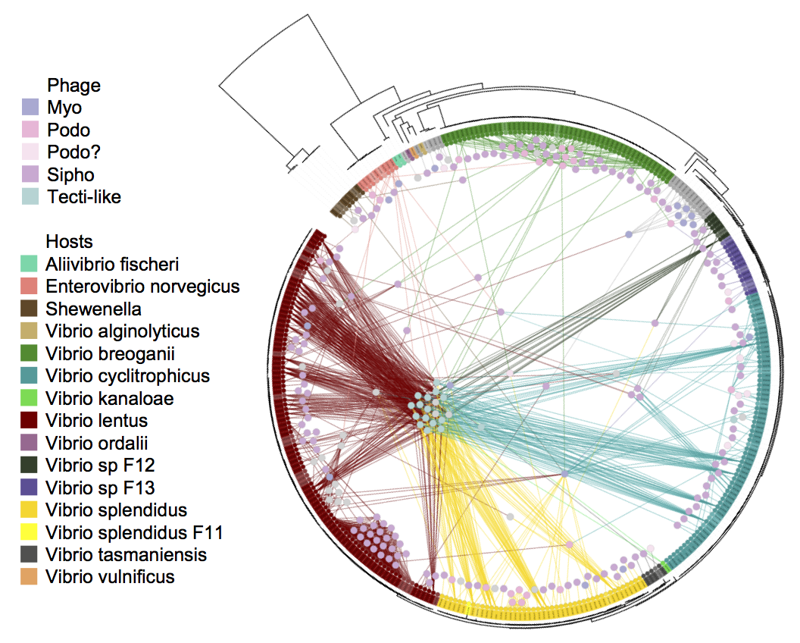
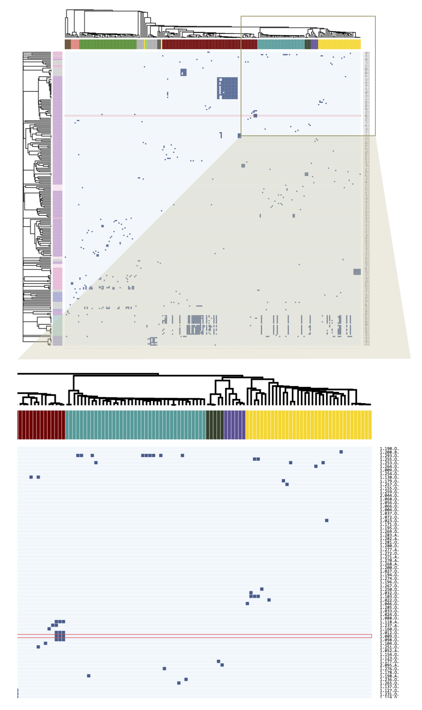
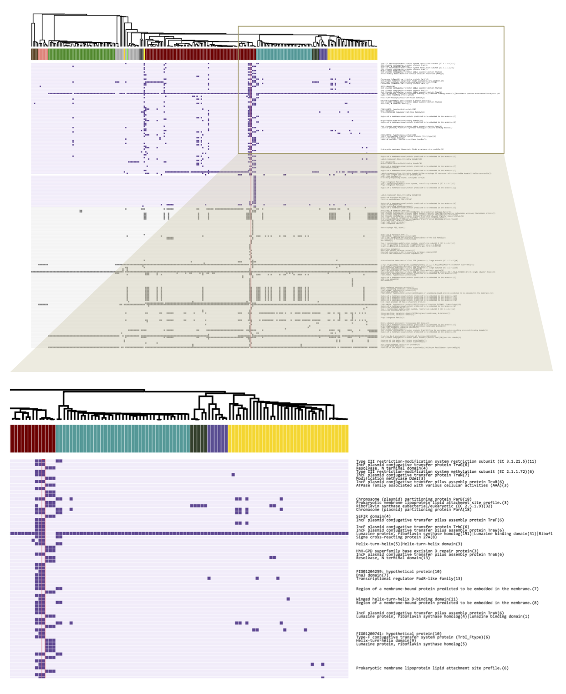
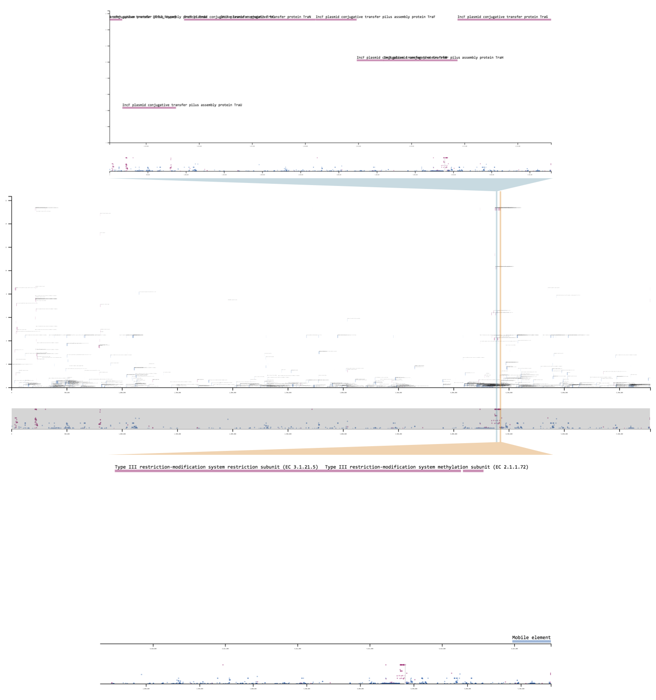
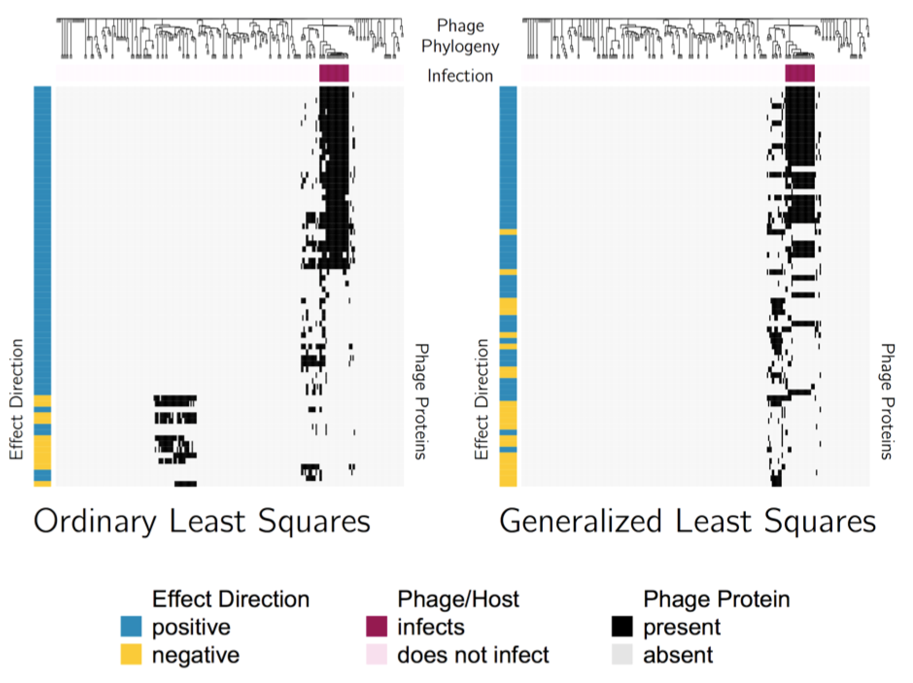

# Interactive visualization of high dimensional genomic data underlying bipartite graph structure in virus-host interactions

\singlespace
Joy Y. Yang$^1$, Kathryn M. Kauffman$^2$, Martin F. Polz$^2$, Libusha Kelly$^3$ \newline 

\noindent $^1$Computational and Systems Biology Program, Massachusetts Institute of Technology, Cambridge, Massachusetts 02139, USA 

\noindent $^2$Department of Civil and Environmental Engineering, Massachusetts Institute of Technology, Cambridge, Massachusetts 02139, USA

\noindent $^3$Department of Systems and Computational Biology, Albert Einstein College of Medicine, Bronx, New York 10461, USA \newline


\noindent J.Y. carried out the computational analyses and wrote the javascript visualization. K.M.K. isolated the bacteria and bacteriophage upon which this work was based. J.Y., K.M.K., L.K., and M.P. conceived of the project, designed the analyses, and wrote this manuscript.

\doublespace
\newpage

## Abstract

In this paper, we discuss methods for exploring, through interactive visualizations, possible genetic bases for successful phage host infections. The dataset we are working with consists of a binary infection matrix, or a bipartite graph, with 243 bacteria (or "hosts") and 241 bacteriophage (or "phage," which are viruses that infect bacteria), as well as genome sequences of all bacteria and all phage. The genomes of the bacteria can be simplified to binary predictor variables indicating the presence/absence of 10,000 protein clusters; and likewise, the genomes of the phage can be represented by 1,000 protein clusters. The questions we ultimately would like to address are - Which host proteins permit or inhibit infection by a particular phage? And which phage proteins promote or are detrimental for infection of a particular host? In most cases, we are unable to definitively identify the exact mechanism of infection or defense; however, we are sometimes able to, from a whole genome of 4000 proteins, narrow in on two or three regions of interest, in order to design future experiments targeting these promising regions. So, the questions we will instead address here are - What additional explorations/experiments do we need in order to answer the initial questions? And what further questions can this dataset inform? Bipartite graphs are common to many fields (for example, medicine - medication and cancer types - and advertising - products and users); and current technology allows us to to collect more complex and larger amounts of data about each node on the graph, (referring to the same examples, transcriptomes of cancers and the mass spectrometry data of medications, or user profiles and product metadata and reviews). While this work focuses on a particular instance in the Nahant Collection, it addresses the need for tools that facilitate intuitive exploration of signals in high dimensional data on bipartite interaction networks. This visualization can currently be accessed at the following address: [http://www.mit.edu/~yangjy/infection_explorer/](http://www.mit.edu/~yangjy/infection_explorer/)

## Introduction

In referring to observational data, Colin Mallows says "science (including statistics) is an iterative process." [@Mallows1998] This is especially pertinent to the dataset discussed here. The "Nahant Collection"  [@Kauffman2014;@Kauffman2018;@Kauffman2018a] is the largest genomically-characterized virus-host bipartite network available (Figure \@ref(fig:bipartite)). This collection includes 243 bacterial hosts representing 19 well-characterized, ecologically-differentiated host species [@Hunt2008;@Preheim2011], and 241 unique viruses representing 18 phylogenetically distinct groups, and 4 morphotypes. The sequenced genomes of the host can be summarized into 10,000 gene clusters, and the genomes of the phage can be summarized into 1000 gene clusters.

The diversity of this dataset presents an opportunity for asking broad ecological questions; however in trying to pin down the molecular mechanisms of infection, the correlation structure as well as the dimensionality means we are faced with many issues of confounding/non-identifiability. In a vast ocean of microbes, sampling just the right organisms with the precise combination of genetic profiles necessary to make a conclusive, causal link is highly improbable. Still, we are able to identify subsets of candidate proteins that may define the structure of the bipartite infection network. Honing in on the precise mechanisms may still require additional experiments. The ultimate goal of the interactive visualization we present here is to facilitate the process of formulating testable hypotheses about biological mechanisms based on large-scale sequencing data. 

This chapter is structured as follows:

1. We introduce the biological context for the data.

2. Using a guided walkthrough approach we provide an example of how an experimentalist might interact with the visualization to generate hypotheses prioritizing the investigation of specific proteins or genomic regions for functional studies.

3. We discuss the reasoning behind the statistics used to summarize the data in the visualization, and how it helps to prioritize relevant signals over spurious correlations

4. Because this visualization is a means of doing exploratory data analysis, we discuss additional analyses, models, and methods for approaching this data.

## The biological context

Study of the interactions between viruses and their hosts over the past century has been the foundation for revealing the rules of the "Central Dogma" that defines the nature and directionality of information flow in cellular systems as well as the discovery of proteins that have been transformative for research, medicine, and bioengineering , including restriction enzymes, Hfr conjugation, transposon mutagenesis, and CRISPR-Cas [@Salmond2015]. There is therefore great interest in identifying additional mechanisms that make up the genomic underpinnings of virus-host interactions. Analyses of growing viral genome databases have revealed that the total number of phage protein clusters has been growing with each sequenced phage genome, without signs of saturation [@Kristensen2013], and on average approximately 70% of predicted proteins in phage genomes are of unknown function [@Gonzalez2015]. There is thus a major need for tools that can guide the prioritization of protein candidates for experimental functional studies.

```{r bipartite, results="asis", echo=FALSE, fig.cap="\\label{fig:bipartite}Depicted here is the bipartite graph representation of the infection data. The hosts (arranged along the leaves of the circular tree) hail from ecologically differentiated populations; the phage (nodes within the circle) are also genetically and morphologically diverse.", out.width="80%"}

```

To address this need, we present a tool for exploratory data analysis to aide in the identification of candidate proteins for experimental study in the context of the Nahant Collection. The fine-scale phylogenetic resolution of this dataset offers the opportunity to identify mechanistic underpinnings of the observed interactions and to experimentally validate the roles of specific proteins in these interactions.

## A guided walkthrough of the visualization

A problem that phage researchers will commonly seek to address is to, upon selecting a phage of interest, identify proteins in hosts that are either positively or negatively associated with infection. Positive associations may be suggestive of proteins that permit infection, for example, membrane receptors on hosts that phage can latch onto, and negative associations may be suggestive of proteins that inhibit infection, for example, restriction modification systems that digest the phage genome once it is injected into the host cell.

The visualization has three main "div"s, or containers, tiled vertically. On first navigating to the page, only the first div 1, the phage-host infection matrix, is loaded. We start by selecting a particular phage from the infection matrix whose infection profile will be matched against host proteins in order to identify host proteins that are either positively associated with (may permit) or negatively associated with (may inhibit) infection. Then a host genome can be selected on which to display the negative log of the regression p-values to create, in essence, a linkage map [@Lander1989]. (A more detailed discussion of how these values are calculated will be presented in the following section of this paper.) To illustrate the logic of the flow described, we walk through an example where we would like to identify host proteins that may inhibit a particular phage infection. Because the screenshots here only convey a rough sense of interaction with the data, we encourage the reader to follow the example on the site: [http://www.mit.edu/~yangjy/infection_explorer/](http://www.mit.edu/~yangjy/infection_explorer/)

### Div 1: Selecting a phage for finding host proteins that may allow or protect against its infection

The infection matrix (Figure \@ref(fig:workflow1)) is displayed immediate upon navigating to the visualization. Here a row (a phage) can be selected. Upon mouseover, a row is highlighted in order to emphasize the infection profile of that phage. In this example, we'll select phage 1.089.O. This particular phage is able to infect 3 closely related hosts that belong to a "microclade" of 5 very closely related *Vibrio lentus* bacteria but cannot infect the 2 other hosts in this clade. This leads us to wonder whether there may be signatures of defense genes in these two uninfected hosts that inhibit the infection.

```{r workflow1, results="asis", echo=FALSE, fig.cap="\\label{fig:workflow1}Div 1 infection matrix and zoom in. The working example of phage 1.089.O. is shown selected.", out.width="80%"}

```

### Div 2: Selecting a host genome for identifying candidate proteins that inhibit infection

Upon clicking phage 1.089.O, the page scrolls down to the next div (Figure \@ref(fig:workflow2)), which becomes populated with another matrix. Here, as with the infection matrix, each column represents a host; but now, each row represents a host protein cluster. A cell in the matrix is filled if the host in that column carries the protein in that row. The host proteins are sorted by their p-values as determined by generalized least squares regression against the infection profile of phage 1.089.O. This technique is futher described in the Methodological Notes section below. The colorbar on the left indicates the effect direction, blue for positive, and red for negative, making it easy for users to distinguish genes that enable infection from those that prevent infection. This plot summarizes the distribution of proteins among hosts in order to faciliate visual comparison of host protein profiles against the phage infection profile. From this plot, any host (column) can be selected. For this example, we'll select host 10N.261.52.C5 (referred to as "host A" from here). This host is one of the two within the "microclade" that cannot be infected by phage 1.089.O to examine any inhibitory features that may exist.

```{r workflow2, results="asis", echo=FALSE, fig.cap="\\label{fig:workflow2}Div 2 gene summaries and zoom in. The working example of host host A is shown selected.", out.width="80%"}

```

### Div 3: Exploring the Manhattan plot to find candidate proteins that may allow or inhibit infection

On selecting host A, the page scrolls to the last div (Figure \@ref(fig:workflow3)), which becomes populated with a genome diagram of the host. The x-axis is genome location, and the y-axis is the regression score. In the main canvas, the length of the boxes plotted are scaled according to the length of the genes, and in the brush region, each gene is plotted as a point at the gene midpoint. The brush region can be used to zoom in on a position of interest along the genome, and the scrolling up and down in the canvas region results in zooming in and out. These functionalities are adapted from Mike Bostock's S&P 500 Brush and Zoom example [@Bostock].

```{r workflow3, results="asis", echo=FALSE, fig.cap="\\label{fig:workflow3}Div 3 and brush selection examples. The two zoomed-in views lie on region 3, the first shows the conjugative transfer element annotations, and the second shows the Type III restriction modification system genes.", out.width="80%"}

```

There appear to be three main regions in host A's genome where proteins highly associated with infection are co-localized. The effect direction in all three of these regions is negative, or appears to be protective against phage infection. This makes sense as we selected a bacterial strain that is not infected by 1.089.O. In this way, we can rapidly identify phage genes that protect against infection.

The first region carries a phage tail assembly gene as well as a bacteriophage repressor gene, likely indicating a virus that has established latency in host A. Perhaps it now participates in host defense to protect from further infection. This is an ecological process known as "competitive exclusion" [@HARDIN1960]. There does not appear to be a protein annotated clearly with a known defense function; however, a possible inhibitory mechanism can simply be competition. If this phage, which is capable of latency, is able to replicate more quickly upon infection by phage 1.089.O, then it may be able to suppress the killing phenotype of 1.089.O.

The second region carries a phage tail tape measure protein and integrases. This region may be another virus, which was able to integrate itself in the host A genome. We do not observe a protein annotated with a defense function here either; however, again, we cannot rule out competition.

The last region is a mobile plasmid that comes equipped with genes that enable it to induce its bacterial host to form a pilus and transfer the element to another cell. Additionally, this plasmid carries a Type III restriction modification system, which places markers on native DNA and recognizes/cuts up foreign unmarked DNA. This plasmid has likely picked up this defense system along the way, and now earns its keep in its host by defending the cell against invasion by foreign DNA.

Which of these hypotheses is/are true? Because the third region has an annotated defense system, we are more inclined to believe this as being the active agent of defense; however, it's worth noting that many of the proteins in all three regions are unannotated (have unknown functions). And because the protein profiles in these three regions are co-linear, we cannot rule out any of the regions as participating in defense, and it could be possible that they all participate to some degree. A more targeted experiment is needed to hone in on the precise region(s) involved in protecting this bacteria from infection. [Please see the following subsection on experiments for discussion of possible experiments that can be done.]

### Backtracking to Div 2: Selecting a genome for identifying candidate proteins that permit infection

Next, we turn to an example that focuses on how to identify proteins in hosts that appear to permit infection by phage. Keeping phage 1.089.O as an example, let's return to div 2, and select the 10N.261.51.F9 ("host B") genome. Div 3 is wiped clean and replaced with a new genome diagram. We see here that the majority of proteins associated with infection are co-localized in a genomic region that seems to be associated with DNA modification and repair. While it's possible that this aids the bacteriophage infection process in some way, a more likely hypothesis is that this element is incompatible with one of the elements described in the previous section. For example, perhaps the repair mechanisms confered by proteins in this region conflict with other remodelling mechanisms in the protective region(s) of host A, making the genome susceptible to 1.089.O infection. The implication here is that while this region may not functionally make its bacterial host susceptible to infection, it may perhaps be indirectly allowing infection by excluding elements that exclude phage 1.089.O. This, however, is again only a hypothesis, and requires additional experiments to verify.

### Designing experiments based on hypotheses suggested by this visualization

We wish to characterize the third region in host A, the plasmid carrying a conjugative transfer pathway, protects the host against infection by phage 1.089.O. We can, using genome recombineering strategies, attempt to delete the element from the host genome, or, because maintaining elements accessory to core cell functions comes at a fitness cost to the host, we can passage the host and look for daughter strains that may have lost the element.

If we are able to obtain a host with element 3 deleted, and it is susceptible to infection by 1.089.O, this suggests that element 3 was important for defense against the phage. We can further validate this genome region as being a defense element by inserting a synthetic version of element 3 into the deletion host and testing whether this new host is once again protected from infection.

We may also wish to test whether elements 1 and 2 participate in infection and can attempt to make combinatorial deletions.

To provide a contrasting example, let's say that we select phage 1.025.O, and set off to find proteins in its hosts that are permissive of infection. Because all of the hosts of this phage are extremely closely related, without a closely related host that is resistant to infection, it is incredibly difficult to hone in on a handful of promising targets, as we lack the appropriate data. Because these hosts are so closely related, and there are too many collinear candidates. Therefore, to accomplish this task we may want to experimentally evolve the hosts until we find resistant strains. Then, from here, we can conduct additional statistical analyses, and continue to iterate between experiments and analyses.

## Methodological notes

### Regression results depicted

Our data cannot be considered to be independent and identically distributed. Bacteria and viruses in the ocean evolve, migrate, and share genes (like any other living organism), and so their genomes are correlated by nature. Each bacterial or viral strain's population can boom or bust based on the environmental conditions, nutrients, and predators. Hence in taking a bucket of water from the ocean, the organisms in this bucket cannot be thought of as being statistically independent. Ignoring phylogenetic relationships can result in relevant signals being drowned out by spurious correlations.

To address this issue, we've employed phylogenetic generalized least squares [@Stone2011]. This is equivalent to "whitening" in signal processing. The idea is to infer the covariance structure among the organisms, then "whiten out" the correlated errors by simply multiplying both the predictor and the response by the inverse square root of the covariance matrix.

\begin{align*}
  Y &= X\beta + \epsilon\\
  \Sigma^{-1/2} Y &= \Sigma^{-1/2} X\beta + \Sigma^{-1/2} \epsilon &  \\
	\widetilde{Y} &= \widetilde{X}\beta + \widetilde{\epsilon} \\
  cov(\widetilde{\epsilon}) &= \Sigma^{-\frac{1}{2}} \epsilon \epsilon' \Sigma^{-\frac{1}{2}}{'} \\
    &= \Sigma^{-\frac{1}{2}} \  \Sigma \  \Sigma^{-\frac{1}{2}}{'} \\
    &= I
\end{align*}

To illustrate the necessity of this correction with an example, Figure \@ref(fig:olsvgls) contrasts associations identified by simple ordinary least squares (OLS) and phylogeny-corrected generalized least squares (GLS) regressions. Here, phage proteins are regressed against the phage infection profiles, as tested against one particular host. The most striking difference here are the negative effects identified by each method. OLS identifies genes that are present in one particularly clonal (or closely related/oversampled) group of phage that cannot infect the host of interest. As an analogy, this would be similar to identifying all variations present in a large family of 18 siblings as being protective against a genetic disease that is present in a member of a different family. While these genetic variations have been observed in 18 people, the people are all very closely related (are oversampled), so the effects of these variations are overestimated, as they are confounded by population structure.

```{r olsvgls, results="asis", echo=FALSE, fig.cap="\\label{fig:olsvgls}Profiles of the top 100 phage proteins found to be associated with ability to infect a particular \textit{Vibrio lentus} host. The columns represent phage genomes, and are ordered according to phylogeny, as depicted by the dendrogram. The black lines immediately below the dendrogram indicate the strains of phage that were able to infect the host of interest. On the heat map, red indicates absence of the protein in a particular phage, while off-white indicates presence of the protein. The color bars on the left indicate whether the effect is positive (blue), or negative (orange).", out.width="80%"}

```

In contrast, GLS identifies genes that are present in strains closely related to the infective population that are not themselves infected. To continue with the analogy, this is similar to identifying a genetic variation present in the healthy twin of a patient as being protective against a disease. Even if this twin is the only observed subject with this variation, we may still feel justified in our suspicions, because the subjects are matched.

### Implementation details

The visualization was written using javascript to assure accessibility for a wide audience. It relies heavily on the D3 library [@Bostock2011] as well as the many beautiful working examples from Mike Bostock.

An attempt to use the out-of-the-box Plotly-R function to display the infection matrix (~60,000 cells) was very slow. So because the matrices of phage-host infections, phage proteins, and host proteins are each sparse, in order to optimize speed and responsiveness, taking a leaf out of the book of coordinatewise sparse encodings, we display only the non-zero values of the matrices.

And to further optimize responsiveness of the visualization, regression results are precomputed. And for purposes of providing a concise summary of the results as well as to keep the browser from having to load too much data, in div 2, only a subset of the results are displayed. The number of proteins displayed is max {200, $n_{holm}$}, where $n_{holm}$ is number of proteins selected by the Holm procedure for controlling familywise error rates. The Holm proceedure was used as to allow us to set the number of tests. Proteins selected by the Holm proceedure are plotted in a purple background, and the rest are plotted in a grey background.

The visualization code will be avaliable on Github ([kellylab](https://github.com/kellylab) and [polzlab](https://github.com/polzlab)).

## Discussion and future analyses

With a large dataset such as the Nahant Collection, it can be difficult to pin down a hypothesis, because there are too many candidate hypotheses to draw from. Which of these hypotheses do the data suggest may be the most promising? What data are relevant for addressing these hypotheses? Which experiments must be done/are feasible?

We have present a simple technique for using interactive graphics to enable intuitive exploration of the high dimensional genomic data associated with this bipartite graph. We hope that it will have some utility for beginning to address these questions. 

A more holistic model should capture the generally lock-and-key nature of infection specificities due to protein interactions (for example, a specific methylase may evade a specific restriction modification system). And, instead of whitening the correlated errors, we could employ a multivariate model, which accounts for population structure through conditioning on all other genes.


