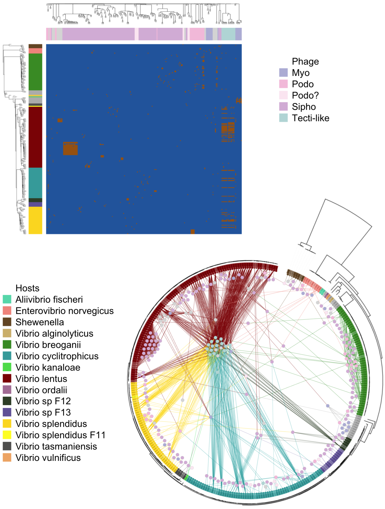
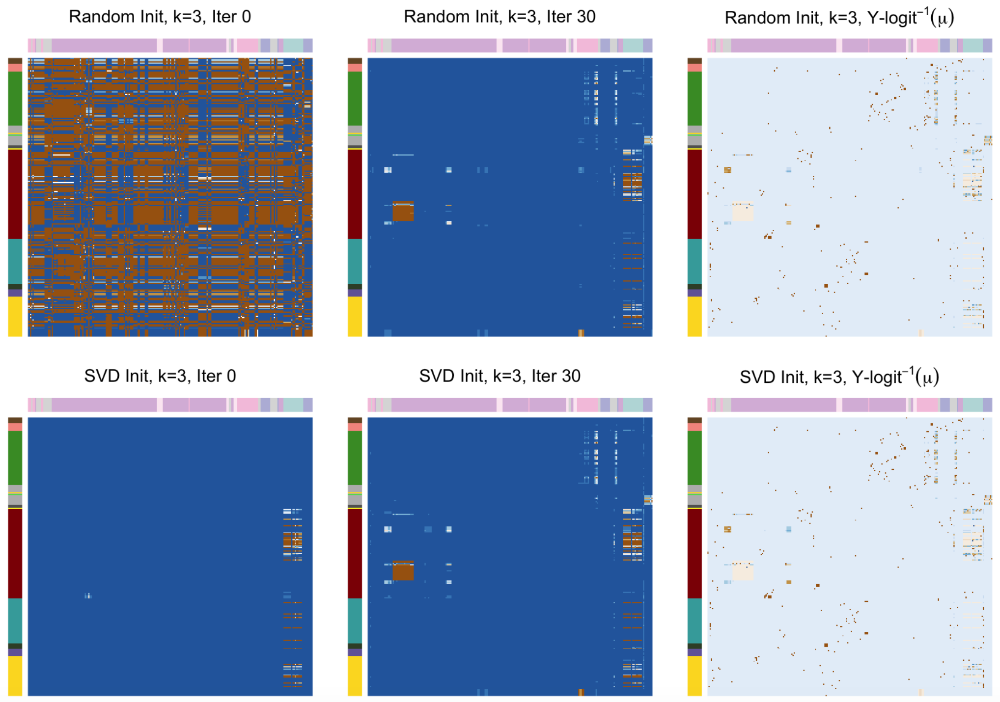
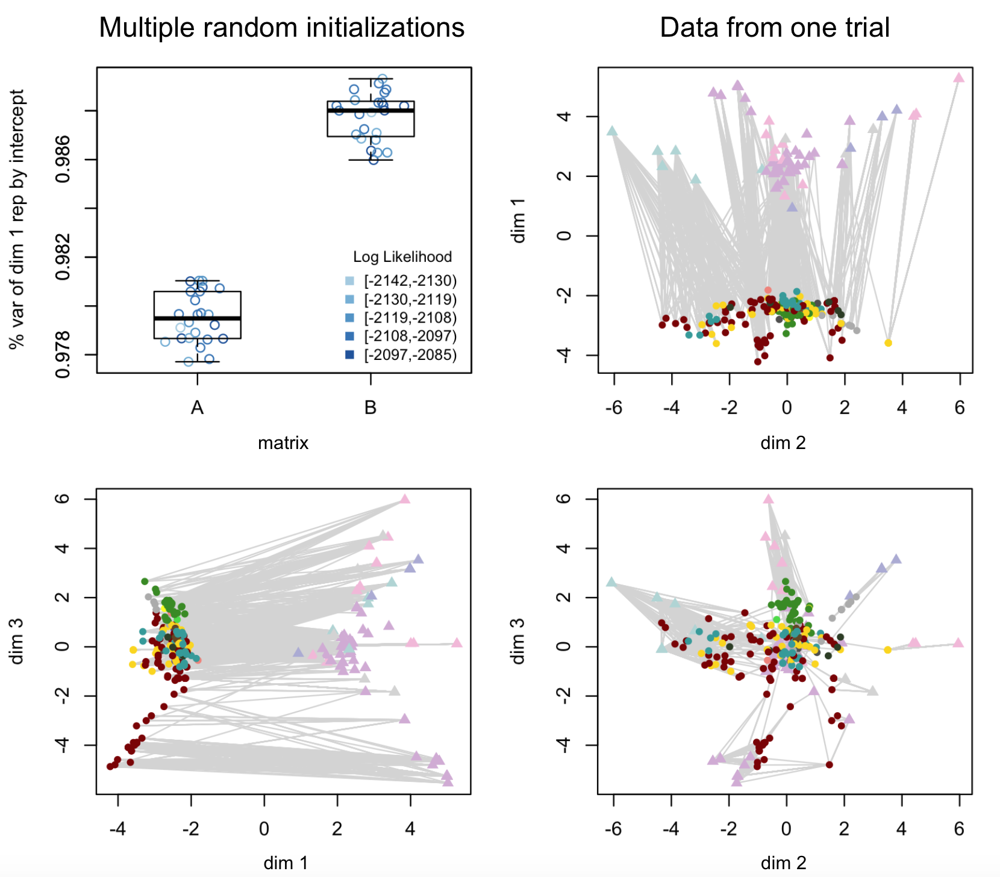
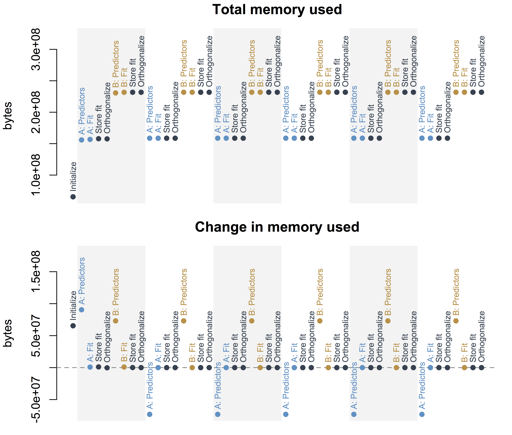
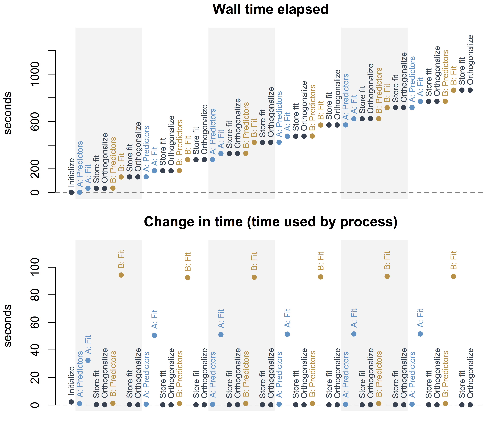
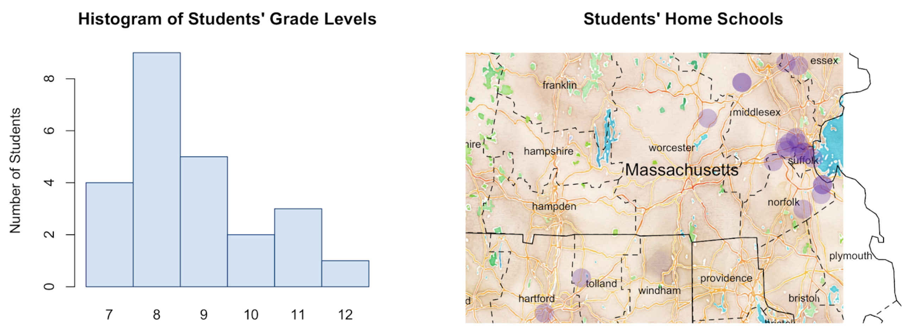
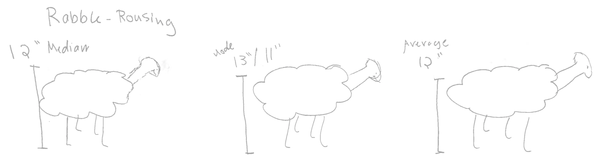

`r if(knitr:::is_latex_output()) '\\appendix'`

`r if(!knitr:::is_latex_output()) '# (APPENDIX) Appendix {-}'` 

<!--
If you feel it necessary to include an appendix, it goes here.
-->

# Predicting Phage-Host Interactions Using Alternating Minimization


\singlespace
Joy Y. Yang$^1$, Libusha Kelly$^2$, Martin F. Polz$^3$, Philippe Rigollet$^4$ \newline 

\noindent $^1$Computational and Systems Biology Program, Massachusetts Institute of Technology, Cambridge, Massachusetts 02139, USA 

\noindent $^2$Department of Systems and Computational Biology, Albert Einstein College of Medicine, Bronx, New York 10461, USA

\noindent $^3$Department of Civil and Environmental Engineering, Massachusetts Institute of Technology, Cambridge, Massachusetts 02139, USA

\noindent $^4$Department of Mathematics, Massachusetts Institute of Technology, Cambridge, Massachusetts 02139, USA \newline

\noindent J.Y. carried out the analyses under the guidance of L.K., M.P., and P.R. P.R. conceived of the methodology for applying alternating minimization to this problem.

\doublespace
\newpage

\noindent **Note:** The following analysis was done without the use of sparse matrices, partially as a first pass, and partially due to the need to separately rescale the matrices $V$ and $H$ (the virus protein matrix and the host protein matrix). However, using sparse matrix encodings would even further reduce memory requirements, and a clever application of the Sherman-Woodbury-Morrison formula should allow us to compute an equivalent solution as that having rescaled $V$ and $H$ accordingly.

## Abstract
In order to address memory constraints, we have applied alternating minimization to a particular formulation of regularized logistic regression. Here, the model predicts edges on a bipartite graph where the number of predictor variables associated with each node is greater than the total number of nodes in the graph.

More specifically, we have a binary infection matrix with 243 bacteria (or "hosts") and 241 bacteriophage (or "phage," which are viruses that infect bacteria), as well as genome sequences of all bacteria and all phage. The genomes of the bacteria can be simplified to binary predictor variables indicating the presence/absence of 10,000 protein clusters; and likewise, the genomes of the phage can be represented by 1,000 protein clusters.

And as infection specificities involve interacting factors between organisms, a more realistic model requires using interaction terms between phage and host proteins. This means 10,000,000 possible interaction terms for the 58,000 observations. With centered and scaled predictors, this amounts to approximately 4.7 TB. Alternating minimization allows us to reduce the memory requirements to around 14 GB.

## Introduction

Work on phage-host interactions from the last century has lead to the discovery of important insights into the central dogma as well as the development of impactful technologies such as restriction enzymes, Hfr conjugation, transposon mutagenesis, and CRISPR-Cas [@Salmond2015]. Still, analysis of phage genomes has revealed that the number of phage orthologous groups (protein clusters) has been growing with each sequenced phage, without signs of saturation [@Kristensen2013]. On average approximately 70\% of open reading frames in a phage are unannotated hypothetical proteins (predicted proteins with unknown function) [@Gonzalez2015]. This vast unknown may hold exciting prospects for future research.

```{r figIntro, results="asis", echo=FALSE, fig.cap="\\label{fig:figIntro}Depicted here are two representations of the infection data. One in matrix form, and the other as a bipartite graph. The hosts hail from ecologically differentiated populations; the phage are also genetically and morphologically diverse.", out.width="70%"}

```

The Polz Lab maintains the Nahant Collection [@Kauffman2014], which consists of 243 *Vibrio* strains challenged by 241 unique phage, all with sequenced genomes. This is the largest phylogenetically-resolved host range cross test available to date. These host strains match to 19 well-characterized populations that have been shown to be coexisting but ecologically differentiated. For example, *Enterovibrio norvegicus* are primarily free-living, *Vibrio cyclitrophicus* are large-particle specialists, *V. tasmaniensis* and *V. splendidus* are generalists, and *V. breoganii* are algal-degredation specialists and form biofilms [@Hunt2008; @Preheim2011]. The phage fall into around 18 phylogenetically distinct groups; have diverse infection strategies, with both broad and narrow host-range phage; and have distinct morphologies, with representatives from nontailed (*Tectiviridae*), and tailed (*Podoviridae*, *Myoviridae*, and *Siphoviridae*) morphotypes.

This is a rich dataset that offers the opportunity to glean mechanistic insights from sequencing data. Our ultimate goal is to generate hypotheses about which proteins may be involved in the infection process. Traditional GWAS-like (genome wide association) methods involve running multiple regressions of the response variable against each predictor variable. The interpretation of each coefficient in this technique only captures the covariance of the response variable with each predictor. We are interested in using a multivariate model that regresses the response variable against all predictor variables. Here, the interpretation of the coefficients captures the covariance of the response variable with each predictor conditioned on the other predictors. The multivariate model also allow us to address the problem from the infection prediction perspective.

However, the challenge is that, as infection specificities involve interacting factors between organisms (for example, a specific methylase from a phage may evade only a specific restriction modification system from a host), the model should include interaction terms between phage proteins and host proteins. With approximately 1000 distinct phage gene clusters and 10,000 distinct bacterial gene clusters, there are 10,000,000 possible interaction terms for the 58,000 observations. This 58,000 x 10,000,000 interaction matrix is roughly 4.7 TB.

## Methodology

To model the infection data based on the phage and host genomes, we use logistic regression:
\begin{align*} 
vec(Y)           & \sim  Bern( \mu ) \\ 
logit(vec(\mu))  & = \beta_0 + X^v \beta_1 + X^h \beta_2 + X^{vh} \beta_3
\end{align*}
Here, $Y$ is a $n_v$ (number of phage) by $n_h$ (number of hosts) matrix of 0/1 values that indicate whether a given phage is able to infect a given host. Here, it is vectorized in order to facilitate the regression. $X^v$ is a $n_h*n_v$ by $p_v$ (number of phage proteins) matrix. It can broadly be interpreted as a matrix of predictors representing virus proteins. More precisely, each column $X^v_i$ is $vec(V_i \otimes 1_{nh})$, where $V$ is a $n_v$ by $p_v$ matrix of phage proteins, and $\otimes$ is the kronecker product. Kronecker products of two vectors are simply vectorized outer products; this notation greatly simplifies matrix representations mentioned later in this paper [@Mardia1979]. Similarly, $X^h$ is a $n_h*n_v$ by $p_h$ matrix of host proteins, which can broadly be interpreted as a matrix of predictors representing host proteins. Each column $X^h_i$ is $vec(H_i \otimes 1_{nv})$, $H$ is a $n_h$ by $p_h$ matrix of host proteins. And finally, $X_{vh}$ is a $n_h*n_v$ by $p_h*p_v$ matrix of phage-host interaction terms $vec(V_i \otimes H_j)$.

Note that this regression can also be written as
\begin{align*} 
Y           & \sim  Bern( \mu ) \\ 
logit(\mu)  &=     VMH'
\end{align*}
Where $M$ is a $p_v$ by $p_h$ matrix of regression coefficients. To be precise, here, the columns of $V$ and $H$ are augmented by a vector of $1$s to represent the lower order terms and intercept. As before, in order to solve for $M$, it is necessary to compute a matrix of predictors $H \otimes V$, which is approximately of size 58,000 x 10,000,000 ($n_v \times n_h \times p_v \times p_h$). If $M$ is decomposed into $AB'$, we now have
\begin{align*} 
logit(\mu)  &=     VAB'H'
\end{align*}
Where $A$ is $p_v$ by $k$ and $B$ is $p_h$ by $k$, $k$ being the rank of the matrix $M$. We can constrain $k$ to a low value and apply alternating minimization to make this regression problem more feasible. In alternating minimization, the matrix in question, here our matrix of coefficients $M$, is written in bilinear form, here $AB'$. A low rank assumption is made, then the alternating steps are solving for $A$ while holding $B$ fixed, and solving for $B$ while holding $A$ fixed. This process is then iterated until convergence.

A particularly notable application of low rank matrix completion was in the winning solution of the Netflix Challenge [@Jain2012; @Koren2009a; @Koren2009]. A nice parallelism to our problem exists in this challenge of drawing edges between users and movies. However our problem additionally comes informed with predictors which would be similar to having detailed demographic information about the users and detailed genre and casting information about the movies. Therefore, continuing with the analogy, the matrix to be completed in our problem is not the users by movies matrix, but rather the matrix of coefficients describing the interactions of demographic and genre. 

A question arises: is the low-rank assumption fair for our problem/data? Because proteins often act as part of a pathway (for example, there can be multiple proteins acting as part of a restriction modification system), vectors of coefficients may be highly correlated, and so the low rank assumption is justified.

To detail the application of alternating minimization to our logistic regression model, in order to solve for A, it is necessary to compute a matrix of predictors $BH \otimes V$, which is of size 58,000 x 1,000 x k (for k=3, this is roughly 1.4 GB). And to solve for B, it is necessary to compute a matrix of predictors $H \otimes VA$, which is of size 58,000 x 10,000,000 x k (for k=3, this is roughly 14 GB). For low k, this is a much less expensive problem to solve in terms of memory. A visual schematic emphasizing the difference between the two methods is depicted below.

\vspace{7pt}

\begin{center}
\begin{tikzpicture}
\node [minimum size=0.7cm, shape=circle,draw,inner sep=2pt, draw=white, fill=black!10] (A) at (6,-1.05) {$\mu_{ij}$};
%\node (N) at (7.5,-1.05) {$(2)$};
\node [minimum size=0.7cm, shape=circle,draw,inner sep=2pt, draw=white, fill=blue!30!green!30] (B) at (0,-0.5) {$v_i$};
\node [minimum size=0.7cm, shape=circle,draw,inner sep=2pt, draw=white, fill=purple!30!blue!30] (C) at (0,-1.6) {$h_j$};
\node (D) at (3.2,-0.75) {$M_{10^3 \times 10^4}$};
\draw[decorate, decoration={brace, mirror, amplitude=8pt}] (0.35,-1.6) -- coordinate [right=8pt] (B) (0.35,-0.5) node {};
\draw[-latex] (B) -- (A);
\end{tikzpicture}

\hspace{25pt}

\begin{tikzpicture}
\node [minimum size=0.7cm, shape=circle,draw,inner sep=2pt, draw=white, fill=black!10] (A) at (6,-1.05) {$\mu_{ij}$};
%\node (N) at (7.5,-1.05) {$(3)$};
\node [minimum size=0.7cm, shape=circle,draw,inner sep=2pt, draw=white, fill=blue!30!green!30] (B) at (0,-0.5) {$v_i$};
\node [minimum size=0.7cm, shape=circle,draw,inner sep=2pt, draw=white, fill=purple!30!blue!30] (C) at (0,-1.6) {$h_j$};
\node [minimum size=0.7cm, shape=circle,draw,inner sep=2pt, draw=white, fill=blue!15!green!15] (E) at (3.2,-0.5) {$u_i$};
\node [minimum size=0.7cm, shape=circle,draw,inner sep=2pt, draw=white, fill=purple!15!blue!15] (F) at (3.2,-1.6) {$w_j$};
\draw[-latex] (B) -- (E);
\draw[-latex] (C) -- (F);
\node (G) at (1.6,-0.2) {$A_{10^3 \times k}$};
\node (G) at (1.6,-1.3) {$B_{10^4 \times k}$};
\draw[decorate, decoration={brace, mirror, amplitude=8pt}] (3.55,-1.6) -- coordinate [right=8pt] (E) (3.55,-0.5) node {};
\draw[-latex] (E) -- (A);
\end{tikzpicture}
\end{center}
\vspace{8pt}

\begin{center}
	\begin{tabular}{ c c c c } 
		\hline
		Solve for & Predictors & Size & Memory \\ 
		\hline
		M & $H \otimes V$ & $5.8e4 \times 1e7$ & 4.7 TB \\ 
		A & $HB \otimes V$ & $5.8e4 \times 3e3$ & 1.4 GB \\ 
		B & $H \otimes VA$ & $5.8e4 \times 3e4$ & 14 GB \\ 
		\hline
	\end{tabular}
\end{center}

\vspace{4pt}

## Implementation and tuning

The dataset was first trimmed down to a more manageable subset of 60 phage proteins and 112 host proteins by performing a first round of lasso with only phage proteins as predictors, then another round of lasso with only host proteins as predictors. To avoid reimplementing regularized logistic regression, the *glmnet* package in R was used. In this smaller problem, the summary table of expected memory usage is as follows:

\begin{center}
	\begin{tabular}{ c c c c } 
		\hline
		Solve for & Predictors & Size & Memory \\ 
		\hline
		M & $H \otimes V$ & $5.8e4 \times 6893$ & 3.2 GB \\ 
		A & $HB \otimes V$ & $5.8e4 \times 183$ & 85 MB \\ 
		B & $H \otimes VA$ & $5.8e4 \times 336$ & 156 MB \\ 
		\hline
	\end{tabular}
\end{center}
\vspace{2pt}

### Initialization

On a subset of 60 phage and 112 host proteins, M can be computed directly. A smart way to initialize the matrices A and B would then be to take the singular value decomposition of M. This initialization was used as a first step in implementing alternating minimization, because starting with values that should be much closer to optimal than random would eliminate initialization as a possible source of failure in implementation.

Because the goal is to use alternating minimization as a means for working with the entire dataset, which we currently cannot do because of memory constraints, ideally, we would like to not need to directly solve for M. The question is then, would random initialization perform just as well? It turns out that random initialization converges at the same rate as SVD initialization (Figure \@ref(fig:figPred), and reaches the similar likelihoods. This bodes well for generalizing the method to the full dataset.

```{r figPred, results="asis", echo=FALSE, fig.cap="\\label{fig:figPred}Initializing A and B randomly performs comparably to initializing with the SVD of M, indicating that random initialization could still be a reasonable strategy when working with the entire dataset.", out.width="80%"}

```

### Scaling A and B

Because $VAB'H'$ is the inner product of $A'V'$ and $B'H'$, if each predictor variable in $V$ and $H$ are centered and $A$ and $B$ are scaled appropriately, $A$ and $B$ effectively project the phage and the host, respectively, into a k dimensional space, where the angle between phage and host that interact are low (or the correlation is high). Therefore, if $k$ is constrained to 2 or 3, $A'V'$ and $B'H'$ can also be used for dimensionality reduction and visualization purposes.

This geometric interpretation is somewhat thrown off by the included intercept variables in $V$ and $H$, which centering would render ineffectual. However, empirically, for solutions of $A$ and $B$ which are orthogonalized after each iteration, the first dimension always represents the intercept term. With the offset removed from the remaining dimensions, the geometric interpretation is again recovered. (Figure \@ref(fig:figGeom))

In a sense then, this is similar to canonical correlation analysis [@Hotelling1936], in which a rotation matrix is chosen for a multivariate set of predictor variables and another rotation matrix is chosen for a multivariate set of response variables in order to maximize the correlation, or minimize the angle, between corresponding rows of predictors and their responses in the first k dimensions. To make this more concrete, a commonly used real-world example is relating multivariate genomic data (each patient has many genomic variation, or colloquially, mutation) to multivariate health metrics (each patient is also associated with records of height, bmi, disease status, etc.). The difference is that there isn't a one-to-one relationship between hosts and phage. It's possible for a host to be susceptible to many phage, and it's possible for a phage to be able to infect many hosts.

```{r figGeom, results="asis", echo=FALSE, fig.cap="\\label{fig:figGeom}When the rank of the coefficient matrices is set to 3, A and B project the phage and host genomes into a 3D space. The first dimension empirically always corresponds to the intercept. Proximity of phage and hosts in the second and third dimensions roughly corresponds to the success of infection. In this figure, the colorscheme is the same as that from before, and to emphasize the difference in organism type, phage are plotted as triangles while hosts are plotted as circles.", out.width="80%"}

```

## Performance engineering results

All analyses in this paper were performed using the R programming language [@rcite]. In order to assess whether these back-of-the-envelope memory calculations hold, we profiled the code using *Rprof()*, a sampling profiler, *Rprofmem()*, which records memory usage each time memory is allocated, and *gc()*, which reports memory usage whenever it is called.

### Memory

Snapshots at each step of the algorithm taken using *gc()* shows that memory usage increases every time the predictors for B are calculated, and memory usage drops when predictors for A are calculated, as they overwrite those for B. The change in memory usage corresponds quite well with the calculated 70 MB difference in the sizes of A and B.

Storing the values of A and B at each iteration takes up a negligible amount of memory, as the matrices are only approximately 1.5 and 2.6 KB respectively. For the full dataset, they would be 24 KB and 240 KB, but still trivial, especially compared to the size of the predictor matrices.

To address the concern that memory usage may fluctuate between the intentionally sampled timepoints, more detailed sampling was conducted using *Rprof()* and *Rprofmem()*. Results from *Rprofmem()* show that three successive memory allocation events of the same size are made when the predictor matrices are calculated, hinting that they may be duplicated during parameter fitting. And indeed, *Rprof()* shows that the maximum amount of memory used at any time is three times the size of the largest matrix (the predictor matrix for B). While this factor of three duplication still allows us to fit to the entire dataset using $k<=3$, additional optimization of memory usage through implementing stochastic gradient descent will be required.

```{r figMemoryPointStore, results="asis", echo=FALSE, fig.cap="\\label{fig:figMemoryPointStore}Blue points highlight operations performed in order to solve for A, the matrix of phage protein coefficients, and tan points highlight operations performed in order to solve for B, the matrix of host protein coefficients. Alternating grey and white backgrounds demarcate successive iterations. Snapshots at each step of the algorithm shows that memory usage increases every time the predictors for B are calculated, and memory usage drops when predictors for A are calculated, as they overwrite those for B.", out.width="80%"}

```

### Runtime

The amount of wall time used to solve for the entire matrix is roughly equivalent to performing 6 or 7 iterations of alternating minimization. At this point, the log likelihood is within a threshold of 0.001 times the magnitude of the log likelihood from the last iteration. This is a reasonable stopping point, and so for this trimmed dataset at a rank set to 3, there is very little time trade-off for the increased efficiency of memory usage. The trade-off, however, comes in the modeling.

```{r figTimePointStore, results="asis", echo=FALSE, fig.cap="\\label{fig:figTimePointStore}Because parameter optimization involves searching in a high-dimensional space, the steps of solving for A and B are inevitably the rate-limiting steps of the method. Directly fitting the matrix M takes 1352 seconds (22 minutes) on the same machine.", out.width="80%"}

```

### Correspondence with the original model

It is comforting to see in figure \@ref(fig:figllcorsvd) that the correlation between parameters from fitting $M$ directly and parameters from computing $AB'$ after alternating minimization climbs with each iteration of the algorithm. However, the correlation only reaches 0.38 (when excluding the intercept term), and the log likelihood only reaches -2100 (whereas the log likelihood solving for M directly is -1460). This isn't too surprising, given that for this analysis, the rank has been set to 3.

Inspection of the eigenvalues from singular value decomposition in the third panel of figure \@ref(fig:figllcorsvd) can give us a hint as to what a more realistic value of k should be. However, it is still difficult to interpolate to the full dataset, as the procedure for picking predictors to form the smaller dataset selects variables with high explanatory power. In general, even in the problem of matrix completion, it is not well understood how k should be set. This is a question for future exploration.

```{r figllcorsvd, results="asis", echo=FALSE, fig.cap="\\label{fig:figllcorsvd}In the first two plots here, the log likelihood and correlation with M (excluding the intercept term, the intercept term is so low in magnitude and so consistent with fitting that including it bumps up the correlation to around 0.97) are plotted for each iteration. Initial values are left off from these plots, since, because the parameters are randomly initialized, the log likelihood starts at -Inf and the correlation starts close to 0. The eigenvalues from singular value decomposition of the coefficient matrix M when solving for M directly is shown in the third plot. The first dimension is left off, since it is a value large in magnitude, corresponding to the intercept.", out.width="100%"}
include_graphics("figurespred/figllcorsvd.png")
```

## Additional directions for exploration

This implementation of alternating minimization is only the first step in the analysis of the Nahant Collection. Matrices in R have been traditionally constrained to having less than $2^{31}$ entries, and for $k>3$, unfortunately, $58,000 \times 10,000 * k$ surpasses $2^31$. While the most recent release of R allows larger matrices, many packages, including *glmnet*, do not yet support this new data structure. So in order to work with $k$ larger than 3, we will need to reimplement elastic net regression.

Additionally, because living organisms can intuitively be placed on a tree, there naturally exists correlation among the bacteria and among the phage. This means that the data is not independently and identically distributed. Our next step is to account for this in order to, as much as possible, avoid identifying spurious associations.

Furthermore, because $p>>n$ the interpretability of parameter estimates is often given up as a hopeless task. Many traditional statisticians will steer away from these types of problems, and in the "machine learning" community, the focus is instead on predictive accuracy. A philosophical question also exists in whether it may, in fact, be ill-advised to seek interpretation or draw any type of inferences whatsoever from this type of data. To address this concern, we turn to Tukey, "Danger only comes from mathematical optimizing when the results are taken too seriously... It is understood that such optimum problems are unrealistically oversimplified, that they offer *guidance*, not the *answer*" We cannot claim that our analysis will be able to root the precise cause of each infection event. Rather, we would simply like to generate testable hypotheses concerning infection mechanisms.

Key to interpretation of parameter estimates is quantifying their uncertainty, and alternating minimization adds another layer of complication in that the original parameters of interest are now vector products of parameters we have solved for. However, taking a bayesian approach may help with this problem, as deriving the probability distribution of sums and products of other quantities with known distributions is straightforward.


# Reasoning Through Games of Chance - Statistics for Play

\singlespace
Joy Y. Yang$^1$, Joseph Elsherbini$^2$ \newline 

\noindent $^1$Computational and Systems Biology Program, Massachusetts Institute of Technology, Cambridge, Massachusetts 02139, USA 

\noindent $^3$Microbiology Graduate Program, Massachusetts Institute of Technology, Cambridge, Massachusetts 02139, USA

\noindent J.Y. and J.E. designed the curriculum, taught the class, and wrote this paper. \newline

\noindent This paper was originally accepted as a contributed paper to ICOTS10; however, due to scheduling conflicts, neither author was able to attend and present the paper.

\doublespace
\newpage

## Abstract

We present a case study of a best attempt at creating a fun and approachable after school statistics curriculum for grades 7-12. Our goal was to use interactive games to provide intuition into a broad range of problems that can be tackled with statistical thinking, as opposed to teaching a comprehensive statistics immersion program. For example, we reviewed distributions by carrying out Fisher's hypergeometric taste testing experiment; introduced game theory by holding an iterated prisoners' dilemma tournament; and "because danger only comes from mathematical optimizing when the results are taken too seriously" (Tukey [@tukey1962future]), ended with correlation/causation critical thinking puzzles. Additionally, we will discuss lessons learned from attempting to synthesize many activity based learning and context-driven statistical education tools that have arisen from conferences such as ICOTS.

## Introduction

We’ve designed a six-session summer weekend curriculum consisting of games, in the spirit of Box’s paper helicopter experiments, [@box1992teaching] that seeks to elicit the context of need under which various statistical analyses were developed/are employed. In this paper, we will first introduce the setting under which we’ve taught this class, then comment on our experience of designing and running the class, and finally discuss the arguments for teaching in this manner by summarizing the viewpoints of seasoned statisticians who have thought deeply about activity-based and context-driven statistical education.
Our materials for this class are available at http://mit.edu/reasoningchance/

## MIT HSSP

MIT Summer HSSP (this acronym has no expanded meaning) is a 6-week 7-12th grade program that runs on Sunday afternoons. Students can register for multiple classes, and MIT-affiliates (undergraduates, graduate students, or alumni) can apply to teach a class of any topic. The MIT Educational Studies Program (ESP) handles the logistics of doing outreach at local schools, recruiting teachers, selecting classes, and reserving classrooms. During 2017, around 1500 students enrolled, and 44 different classes were offered over a wide range of topics: swing dancing, complex analysis, adulting 101; etc. MIT ESP encourages students to leave the classroom if they find that they are not enjoying the material.

Under this program, we piloted a probability/statistics teaser series called "Reasoning through games of chance." The afterschool program format meant that our lesson plans could not be a regimented, comprehensive overview of statistics. Instead, we indulged in prioritizing fun and intuition, with the aim of encouraging students to think about where, in their lives, chance and data play a role, and how they can use probability and statistics to explore their environment.

## Class Setup

While we did not require programming as a prerequisite and did not plan to teach students how to code, we wanted students to realize that statistics is deeply intertwined with computing, as eloquently expressed by [@nolan2010integrating]. To this end, we requested the use of laptops and were given access to 12 chromebooks. The class size was then limited to 24 students so that each group of 2 students could work with one chromebook. Each chromebook was associated with a google classroom account to facilitate distribution of activities and interaction among groups.

We also prepared short code snippets on Rfiddle (http://www.r-fiddle.org/) to demonstrate basic functions and simulations. Because saving fiddles creates urls with different version numbers, we could update the fiddles live and ask students to follow along by navigating to newer versions. Students were also encouraged to continue playing with the code on their own time. 

The students were from a wide range of different schools and grades. This sounds challenging; however, we believe it worked to our advantage. Each class was almost entirely activity based. So while in theory, our goal was to teach using guiding questions, in reality, the students taught each other.
 
```{r studentDem, results="asis", echo=FALSE, fig.cap="\\label{fig:studentDem}This map omits two students, one from Maine, another from Illinois.", out.width="90%"}

```

In general, we tried to encourage as much discussion as possible and aimed to maintain an atmosphere of organized chaos. And while the precise class structure varied from week to week, the scaffolding we used for planning was somewhat consistent: we started with an ice-breaker, followed with drill exercises, and ended with an experiment, or "game." 

To provide an example, we will use class 2: distributions and hypothesis testing. The learning goal was to expose students to the concept of a "null model," and encourage them to consider what a null outcome should look like.

The icebreaker (~10-20 min) was often only tangentially related to the main topic. Because there are many ways of approaching the same problem, and problems can often be reduced to each other, these tangents allowed us to point out subtle connections among topics. Our icebreaker in class 2 was a classification problem. Pairs of students were given 12 labeled images that fell into two categories, for example, chessboards from either early in the game or late in a game. Students were then asked to come up with rules that categorized their images. For instance, a rule might be "the image is from (early/late) in the game if the number of pawns on the board is (less than/equal-to/greater than) c." After the students designed a set of rules, we then gave them 4 additional images to test how well their rules did.

For the drill exercises (~20-40 min), we typically asked students to number off into groups of four, then work out the answers together on board space marked for each group. Because the icebreakers were usually very open ended, and the games focused on having fun, these more structured exercises were intended to hone in on the relevant concepts of the week. Using boards helped promote interaction within the groups and allowed us, as the teachers, to easily identify and brainstorm with groups that looked stuck. The drill exercises in class 2 aimed to reinforce concept of distributions. There were two parts: In part one, students answered various questions about heights of Lilliputians by reading a histogram, and were then asked how likely it was Gulliver was a Lilliputian. In part two, students were given sequences of coin-flips and guided through deducing the geometric distribution by calculating probabilities for runs of heads and tails. They then used this information to determine which sequences were from real coin flips and which were faked by the instructors. Half of the groups worked on part one and the other half on part two. After everyone had finished, the groups swapped boards to discussed/corrected another group’s work.

Finally, the goals for the games (~30-40 min) were to demonstrate that statistical thinking is fun and to provide an example of how students can apply probability and statistics in their own lives. In class 2, the game was a taste testing experiment. We had three different tests: skittles vs. m&ms, coke vs. pepsi, and different colors of vegetable chips. Students worked in groups of three to administer the tests and record the results in a linked spreadsheet. We then briefly talked about the hypergeometric distribution as a null and showed the students the distribution of their cell counts compared to the null. Students were then asked to explain what the visualizations meant and whether we had evidence that people could discriminate between the different foods.

## Reflection and Outlook

Statistical thinking is a necessary companion of the scientific process; or if we dare to go as far as Stigler, statistics is "a unified logic of empirical science." A corollary to this, as stated poignantly by Rebecca Nugent in her JSM 2017 talk [@Nugent2017], is that "statistics does not belong to statisticians, statistical questions are present in every field, from physics, to chemistry, to history." So in an attempt to attract as diverse a group of students as possible, we required no pre-requisites, marked the difficulty for our class to be 1 (on the scale of 1-4, 1 being the lowest), and welcomed students from the entire range of 7-12 grade.
Still, there’s quite a bit of selection bias present in a group of students who come to MIT on weekends in the summer. When asked what their favorite subject were, most of our students said math, and only one student said English. Our students were incredibly supportive. They were eager to have fun and quick to come up with entirely unexpected responses.

```{r sheep, results="asis", echo=FALSE, fig.cap="\\label{fig:sheep}When asked to summarize the sheep in their herd, one group responded with pictorial summaries.", out.width="100%"}

```

We designed the activities to focus on intuition, and did not attempt to be mathematically rigorous. We did attempt to teach the Bayes class using probability notation, and our students became uncharacteristically frustrated. We had not built up the intuition before introducing the symbols, and so the symbols carried no meaning. To the final question of a worksheet ("what are some ways that you can increase the accuracy of the test?"), one student responded, "math, solve your own problems." We found this humorous but also alarming. This student had come in with math as her favorite subject, and we had a responsibility for encouraging her mathematical curiosity, or at the very least, for not discouraging her. So after class we sent a out new explanation based on intuition. We also reworked the lesson plan to no longer use probability notation. This new lesson plan was tested on November 18-19, and seemed to be received with greater success. However, the class sizes were also smaller, so there may have been some amount of confounding.

Focusing on intuition has a twofold advantage: as [@moore1997new] pointed out, in democratizing statistics we should "avoid the 'professional's fallacy' of imagining that our first courses are a step in the training of statisticians." For students who do not choose to continue on with statistics, it is the big picture ideas, and not the fine-grained details that will leave a lasting impression. And for students who do decide to pursue statistics, again quoting [@moore1992teaching], "most of our students would better master theory after some acquaintance with practice." 

Gudmund Iversen explains from his experience: "Those students who have had my Statistical Thinking course early (freshmen, sophomores) are having a ball with mathematical statistics as juniors or seniors. Others struggle more because they get bogged down by probability theory and mathematical niceties like moment generating functions, and they have a harder time seeing what statistics is all about. This points to a need to hear statistics twice before it makes sense, and we cannot lose the connection to real data." [@cobb1992teaching] Our hope was that by placing emphasis on simply having fun, we could plant a seed to mark a spot that students may conceivably want to revisit, sooner rather than later.

One advantage we had during HSSP is that we had a returning group of students over the course of six weeks, so we were able to refer back to examples from previous classes. However, we realize that running examples can create barriers to entry, and many after-school programs may not have the luxury of continuity. So in order to increase the accessibility and versatility of this set of lesson plans, we’ve also adapted three of the classes from this series for SPLASH, another MIT ESP program with a one-weekend-only format, held, this year, November 18-19.

While we do not have enough space here to discuss SPLASH in detail, interestingly, we had a very different audience. Only about 10% of our students said Math was their favorite subject, and one student made a seemingly outlandish comment about hating the coordinate system when he first learned about it. When asked to elaborate, he said, "In school they have you draw this Cartesian grid, and then plot things like lines on it, but it seemed pretty pointless. Then, I realized that you can actually graph food or baseball statistics, and I became a lot more interested. I'm not really bad at math, but most of the times it just seems really pointless and boring to me, because they don't tell you what you can use it for."
Behind each statistical method, there are many fascinating stories about how it is used. Playfully invoking these contexts makes statistics relatable [@davies2010one;@dierdorp2010educational;@franklin2005curriculum], and we are excited about the prospect of using this thought process to design additional afterschool lesson plans that are accessible at the jr. high/high school level.

## Acknowledgements

We’d like to thank to Max Shen and Hayley Gadol for co-teaching. We also owe so many thanks to Luke Miratrix for activity ideas and feedback on the agendas for most of our lesson plans as well as this paper. Our curriculum benefitted greatly from activities developed previously by others. [@garfield1993teaching;@gelman2017teaching;@Kaufman2010] An interest in context-based education came from many dinner-table conversations among friends (Leanne Fan, Charlie Shi, Matt Nickell, and Kelly Vitzhum) that evolved into writing an education grant. While we did not receive the grant, this concept has become a mild obsession for each of us in our respective fields. And finally, we’d like Libusha Kelly for her thoughtful comments on this paper.

